# Lab 1: Workflow Setup 

### Task 1: Create the Project Repo

In this task, you'll access the GitHub enterprise account and create a new repository to store the infrastructure.

In this task, you will create an account in [GitHub](https://github.com) and use `git` to add lab files to a new repository.

1. In a new browser tab open ```https://www.github.com/login```. From Environment details page ***(1)***, navigate to **License** ***(2)*** tab and **copy** ***(3)*** the credentials. Use the same username and password to login into GitHub.

    
   
1. For **Device Verification Code**, use the same credentials as in the previous step, open `http://outlook.office.com/` in a private window, and enter the same username and password used for the GitHub Account login. Copy the verification code and Paste code it in Device verification.

    
    
1. In the upper-right corner, expand the user **drop-down menu** ***(1)*** and select **Your repositories** ***(2)***.

   

1. Next to the search criteria, locate and select the **New** button.

   

1. On the **Create a new repository** screen, name the repository ```github-action``` ***(1)***, select **Public** ***(2)*** and click on **Create repository** ***(3)***  button.

   
   
   > **Note**: If you observe any repository existing with the same name, please make sure you delete the Repo and create a new one. Please follow the step 6 to step 10. Else, skip to step 11.

1. In the upper-right corner, expand the user **drop-down menu** ***(1)*** and select **Your repositories** ***(2)***.

   

1. Using the search bar, search for ```github-action``` **(1)** and select to open it.

   

1. From the GitHub repository, click on the **Settings** tab.

   

1. In the settings page, scroll to the bottom of the page and select **Delete this repository**.

   

1. In the pop of delete `{github-username}/github-action` click on **I want to delete this repository**.

   

1. In the pop of delete `{github-username}/github-action` click on **I have read and understand these effects**.

   

1. In the pop of delete `{github-username}/github-action` to conform, Copy the **repository name** **(1)**, paste it in the **box** **(2)**, and click on I understand the consequences, **Delete this repository** **(3)**.

   

### Task 2: Introduction to GitHub Actions and workflow files.

GitHub Actions is a powerful automation tool provided by GitHub, allowing you to automate your software development workflows directly within your GitHub repository. With GitHub Actions, you can build, test, and deploy your code without leaving GitHub, saving time and improving collaboration among your team members.

1. Navigate to the **Action** **(1)** directory in your repository, in `Get started with GitHub Actions` click on **set up a workflow yourself** **(2)**.

    

1. In the workspace rename the file it to **hello-action.yml** **(1)**, paste the below code in the **edit** **(2)**, and click on **commit changes** **(3)**.

    ```yaml
    name: My First Workflow

    on: [push]

    jobs:
        build:
            runs-on: ubuntu-latest

            steps:
            - name: Print a greeting
              run: echo "Hello, GitHub Actions!"
    ```

    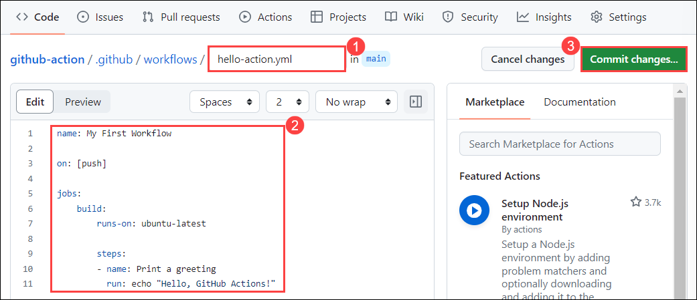 

1. In the pop up windows of **Commit Changes** click on the **Commit changes**.

   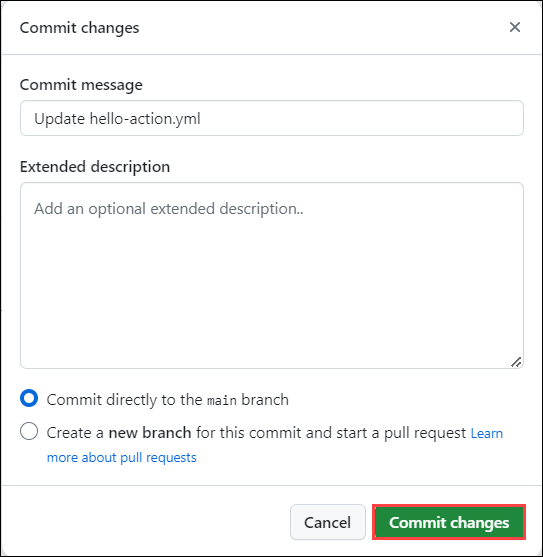

1. Click on **Action** **(1)**, once the workflow got succedded click on Workflow **hello-action.yml** **(2)**.

   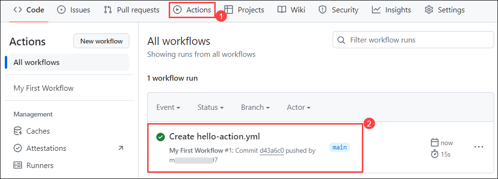

1. In the `hello-action.yml` workflow, click on **build** **(1)**, expand the **Print the greeting** and view the result. 

   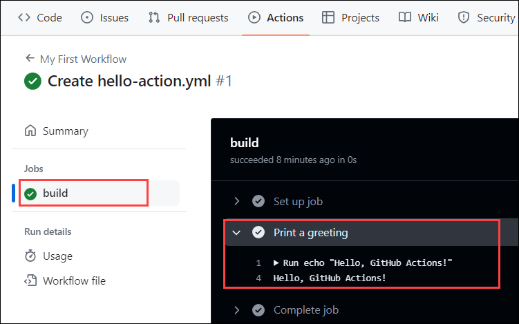

### Task 3: Triggering workflows with events like pushes and pull requests.

GitHub Actions workflows can be triggered by various events occurring within your GitHub repository. These events include pushes to branches, pull requests, issue comments, repository dispatch events, and more. By defining the events that trigger your workflows, you can automate specific actions to run at the right time, optimizing your development process and enhancing collaboration. Let's explore how to trigger workflows with events like pushes and pull requests:

**Triggering Workflows with Push Events:** Push events occur when changes are pushed to a branch in your GitHub repository. You can specify which branches trigger your workflows based on specific criteria, such as pushes to all branches or only certain branches. Here's how you can configure a workflow to trigger on push events

**Triggering Workflows with Pull Request Events:** Pull request events occur when pull requests are opened, synchronized (updated), closed, or labeled. You can configure workflows to trigger based on pull request events to perform tasks such as code review, testing, and deployment. Here's how you can configure a workflow to trigger on pull request events 

1. Navigate to the **Code** **(1)** and click on **.github/workflows** **(2)** folder.

    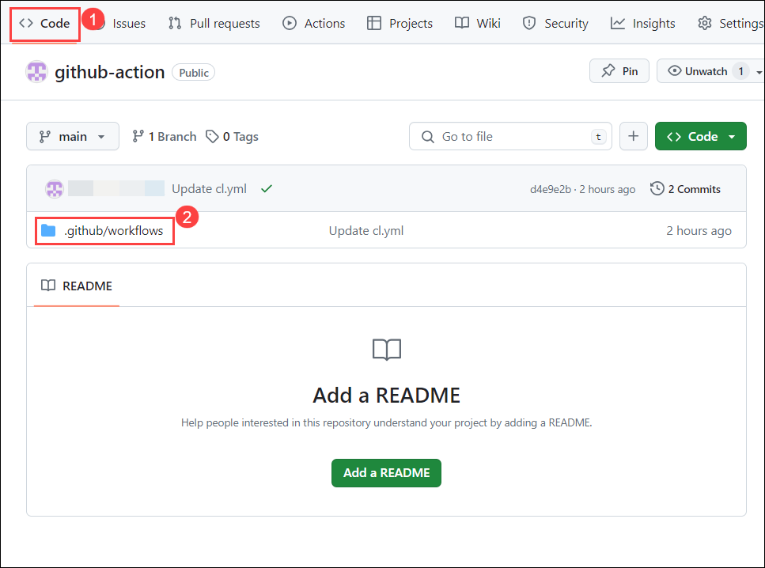

1. In the **.github/workflows** folder, click on **Add files** **(1)**, and click on **+ Create new file** **(2)**.

    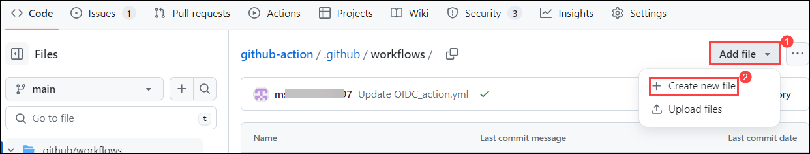

1. Provider file name as **cl.yml** **(1)**, in the editor **copy and paste** **(2)** the below script, and click in **commit changes** **(3)**.

   ```
   name: My Workflow
   on:
     push:
       branches:
         - main
     pull_request:
       branches:
         - main
   jobs:
     build:
       runs-on: ubuntu-latest
       steps:
         - name: Checkout code
           uses: actions/checkout@v2

         - name: Run a script
           run: echo "Hello, again!"   
   ```

   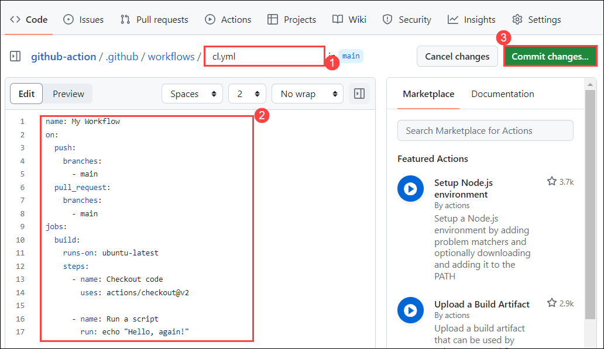

1. In the pop up windows of **Commit Changes** click on the **Commit changes**.

   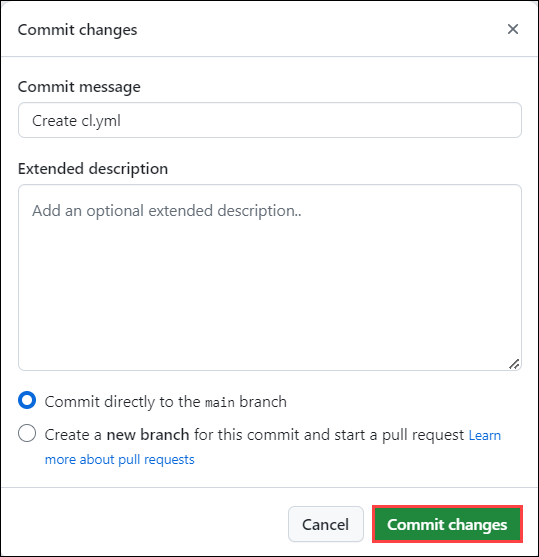

    - You can customize the events and branches for triggering the workflow according to your project's requirements. For example, you might want to trigger the workflow only on pushes to the `main` branch or on pull requests targeting the `main` branch.

    - You can also add more jobs and steps to perform tasks like building, testing, deploying, or any other actions you need your workflow to perform.

    - For more details on GitHub Actions syntax and available events, refer to the official documentation: [GitHub Actions - Workflow syntax for GitHub Actions](https://docs.github.com/en/actions/reference/workflow-syntax-for-github-actions).

1. Click on **Action** **(1)**, verifiy the workflow has been executed successfully.

   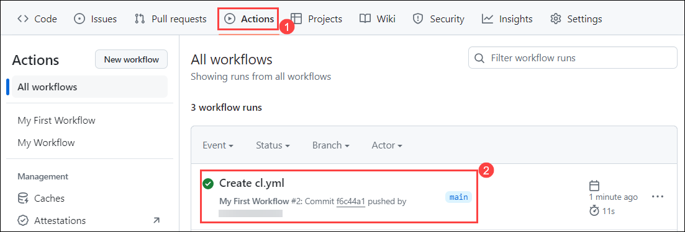

### Task 4: Defining jobs and steps within workflows

In GitHub Actions workflows, you define jobs and steps to orchestrate the tasks you want to automate. Jobs represent the individual units of work that can run in parallel or sequentially, while steps are the individual tasks performed within a job. Let's dive deeper into defining jobs and steps within workflows:

**Defining Jobs**: Jobs are defined within the `jobs` section of your workflow file. Each job consists of a series of steps that are executed sequentially by default. However, you can configure jobs to run in parallel by specifying dependencies between them. Here's how you define jobs within a workflow:
   
**Defining Steps**: Steps are the individual tasks performed within a job. Each step represents a specific action or command that GitHub Actions executes as part of the workflow. Steps can include checking out code, installing dependencies, running tests, deploying applications, and more. Here's how you define steps within a job:

1. Navigate to the **Code** **(1)** and click on **.github/workflows** **(2)** folder.

    

1. In the **.github/workflows** folder, click on **Add files** **(1)**, and click on **+ Create new file** **(2)**.

    

1. Provider file name as **jobs.yml** **(1)**, in the editor **copy and paste** **(2)** the below script, and click in **commit changes** **(3)**.

   ```
   name: My Workflow
   
   on:
       push:
           branches:
           - main
       pull_request:
           branches:
           - main
   
   jobs:
       job1:
           runs-on: ubuntu-latest
           steps:
           - name: Checkout code
             uses: actions/checkout@v2
       
           - name: Run a script
             run: echo "Hello, world!"
       
       job2:
           runs-on: ubuntu-latest
           needs: job1
           steps:
           - name: Checkout code
             uses: actions/checkout@v2
       
           - name: Run another script
             run: echo "Hello, again!"
   ```

   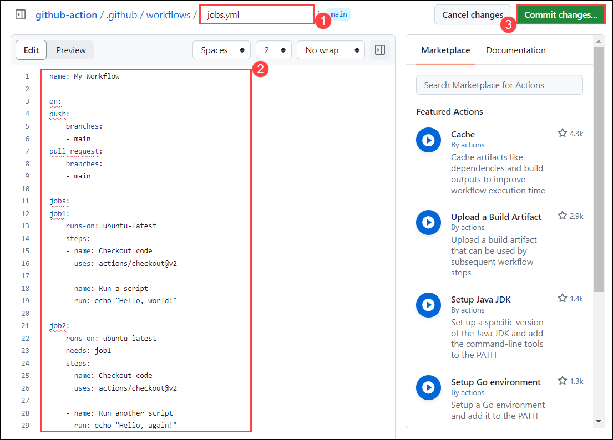

1. In the pop up windows of **Commit Changes** click on the **Commit changes**.

   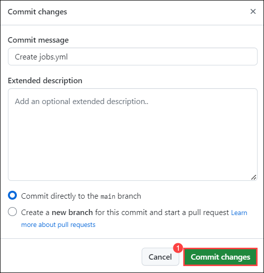

    - You can customize the events and branches for triggering the workflow according to your project's requirements. For example, you might want to trigger the workflow only on pushes to the `main` branch or on pull requests targeting the `main` branch.

    - You can also add more jobs and steps to perform tasks like building, testing, deploying, or any other actions you need your workflow to perform.

    - For more details on GitHub Actions syntax and available events, refer to the official documentation: [GitHub Actions - Workflow syntax for GitHub Actions](https://docs.github.com/en/actions/reference/workflow-syntax-for-github-actions).

1. Click on **Action** **(1)**, verify the workflow has been executed successfully once the workflow is succedded select the newly created workflow **updated cl.yml** **(2)**.

   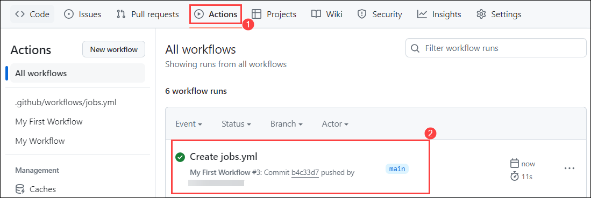

1. Verify the jobs and feel free to go through the workflow.

   

1. Click on **Next** button for next Lab.

### Summary

In this lab, you have successfully set up our workflow. You have created and executed a workflow, verified its successful execution, and familiarized ourselves with the jobs within it. This foundational knowledge will be instrumental as we progress through the subsequent labs.
