# Lab 2: Action Integration

### Task 1: Incorporating pre-built actions from the GitHub Marketplace

In this task, you will learn how to create a Docker repository and verify its successful creation. You will navigate through Docker Hub, create a new repository, and then cross-verify its creation.

1. In the Egde browser add a new tab and navigate `https://login.docker.com/u/login` page if you already have an Docker hub account **enter Username or email address** **(1)** and click on **Continue** **(2)**.

    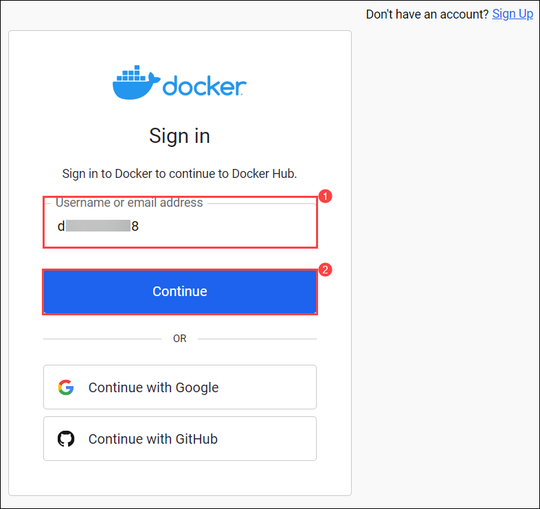

2. If you don't have an account in the Docker Hub click on `sign up`.

    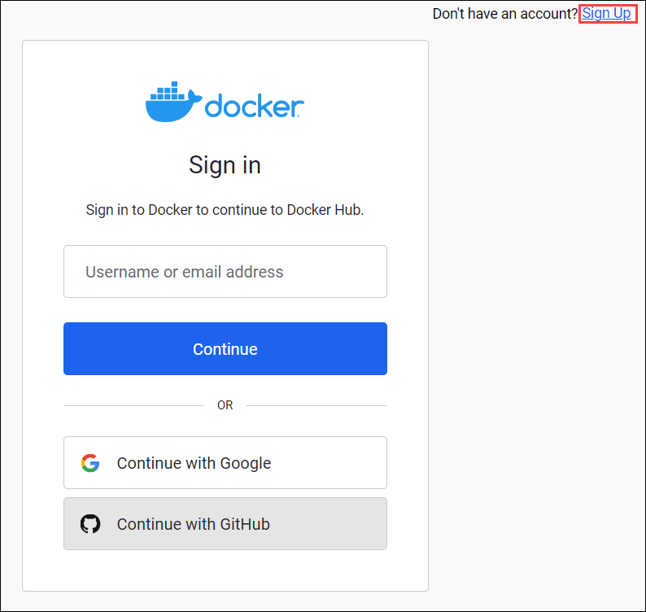

3. On the signup page of Docker Hub enter your **personal email id** **(1)**, provide a unique **Username** **(2)**, provide a **Password** **(3)**, click on the check box for **Send me occasional product updates and announcements** **(4)**, and click on **Sign Up** **(5)**. Perform Step 3

    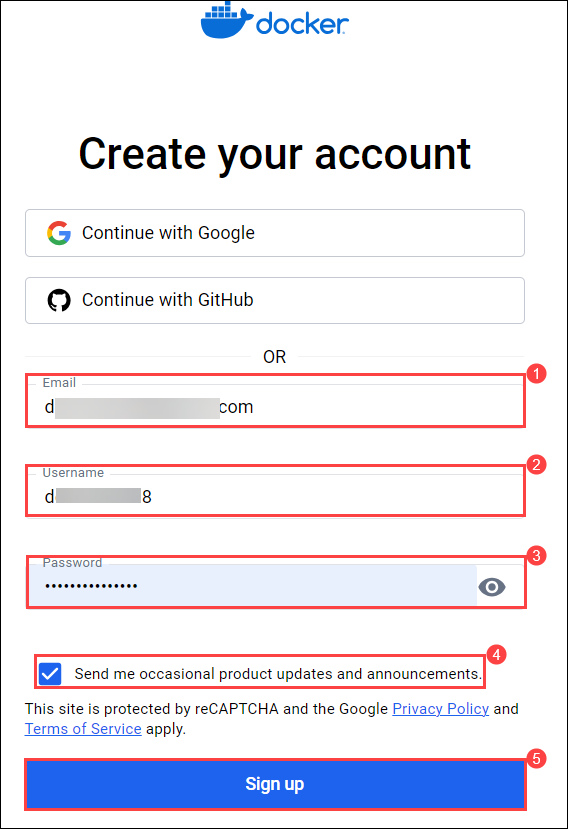

4. Enter the **Password** **(1)** and click on **Continue** **(2)**.

    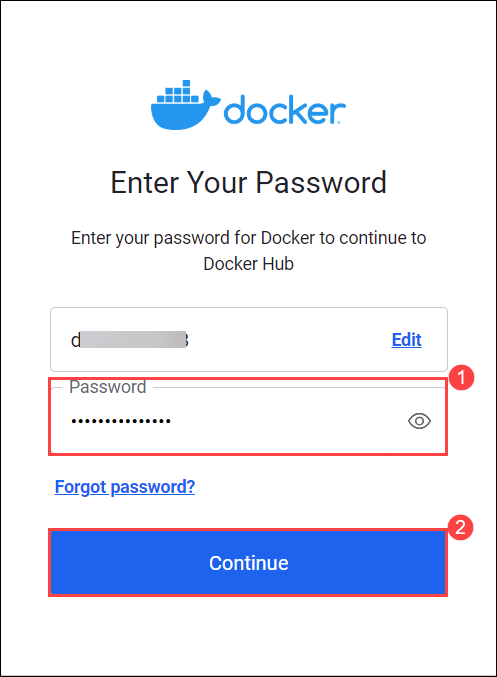

5. Login to the Personal Email and **Verify Email Address** sent by docker.

6. In the Docker Hub tab click on **Profile** **(1)** and click on **My Account** **(2)**.

   

7. In the Docker Hub my account tab click on **Security** **(1)** and click on **New Access Token** **(2)**.

   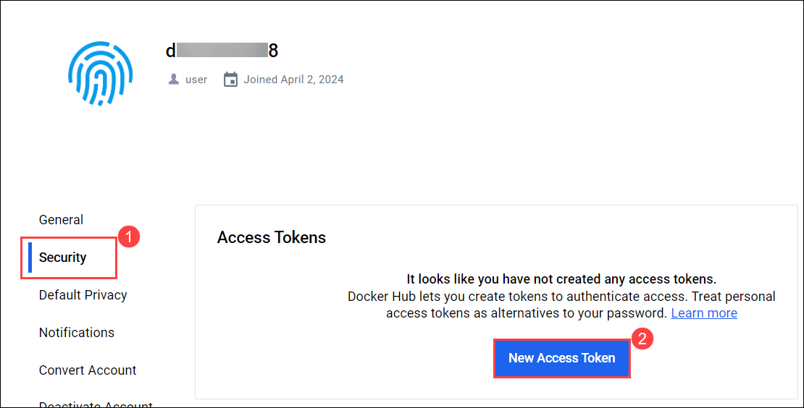

8. In **New Access Token** pop-up, enter the Access Token Description as **docker-demo** **(1)**, and click on **Generate** **(2)**.

    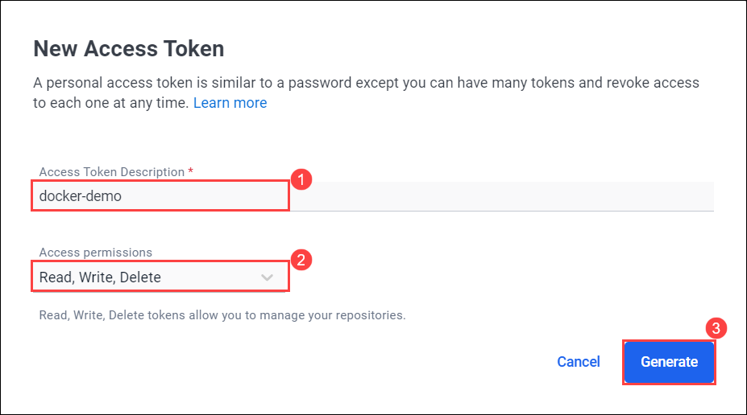

9. In the **Copy Access Token** pop-up, click on **Copy and Close** button and paste the copied access token in a notepad for the future.

    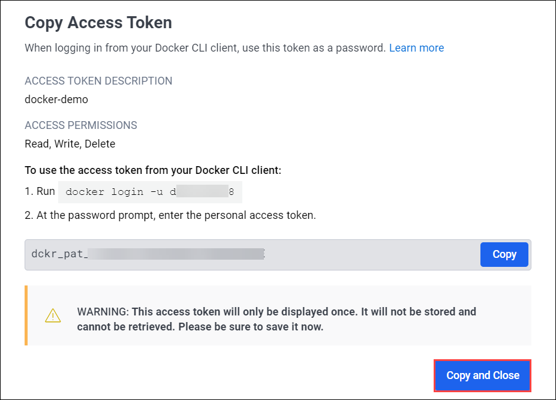

10. **Find an Action**: Browse the [GitHub](https://github.com/marketplace?type=actions) Marketplace to find an action that suits your needs. You can search by keywords, and categories, or use filters to narrow down the results.

11. In the **GitHub Marketplace**, in search bar search for **Build and push Docker images** **(1)** hit enter, select **Build and push Docker images** **(2)** and feel free to go throught the content.

    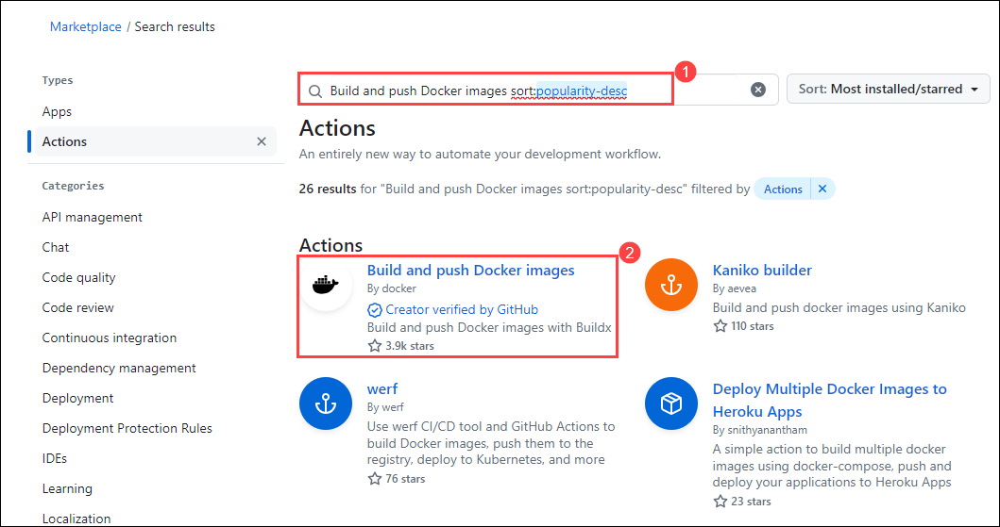

    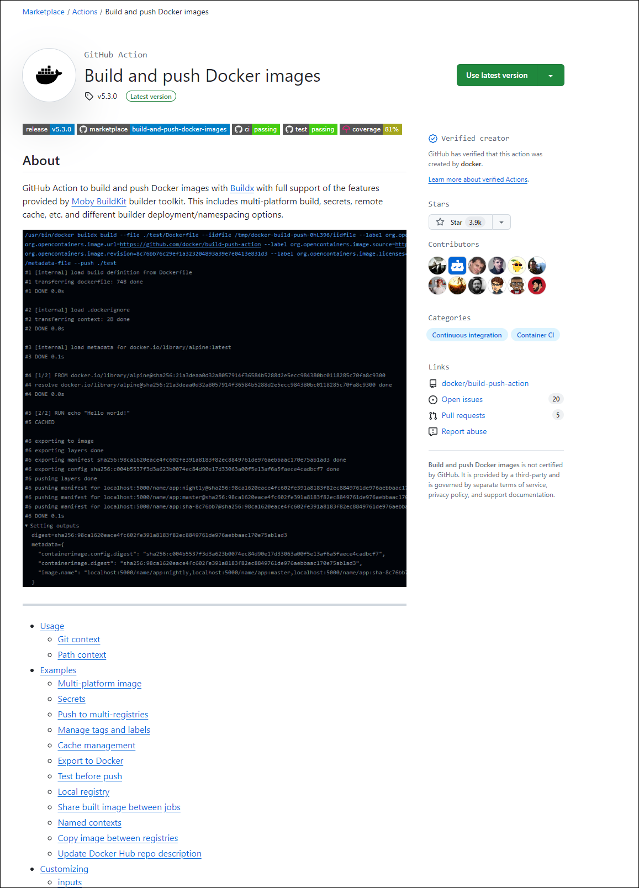

12. Now let's create a workflow to publish into Docker Hub using GitHub action. Navigate to the **Code** **(1)**, click on **Add File** **(2)** and click on **+ Create new file** **(3)**.
    
    

13. Provider file name as **docker** **(1)**, in the editor **copy and paste** **(2)** the below script, and click in **commit changes** **(3)**.

    ```
    # Use an official Nginx runtime as a parent image
    FROM nginx:latest

    # Copy the HTML file to the Nginx container
    COPY index.html /usr/share/nginx/html

    # Make port 80 available to the outside of the Docker container
    EXPOSE 80

    # Start Nginx when the container launches
    CMD ["nginx", "-g", "daemon off;"]
    ```

    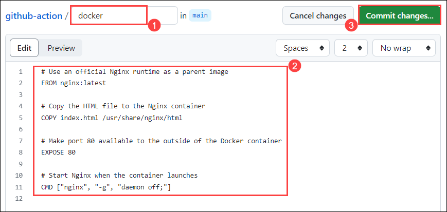

14. In the **Commit changes** pop-up, click on **Commit changes** button.

    

15. Now let's create a workflow to publish into Docker Hub using GitHub action. Navigate to the **Code** **(1)**, click on **Add File** **(2)** and click on **+ Create new file** **(3)**.
    
    

16. Provider file name as **index.html** **(1)**, in the editor **copy and paste** **(2)** the below script, and click in **commit changes** **(3)**.

    ```
    <!DOCTYPE html>
    <html>
    <head>
        <title>GitHub Actions Workshop</title>
        <style>
            body {
                font-family: Arial, sans-serif;
                margin: 20px;
            }
            h1 {
                color: #333;
            }
            h2 {
                color: #666;
                margin-top: 30px;
            }
            p {
                margin-bottom: 20px;
            }
            ol {
                margin-left: 20px;
            }
        </style>
    </head>
    <body>
        <h1>GitHub Actions Workshop</h1>
        <p>Welcome to the GitHub Actions Workshop! This workshop is designed to help you understand and implement GitHub Actions effectively in your projects. Whether you're new to GitHub Actions or looking to enhance your existing knowledge, this workshop covers a range of topics to get you started and take your workflows to the next level.</p>

        <h2>Table of Contents</h2>
        <ol>
            <li><a href="#workflow-setup">Workflow Setup</a></li>
            <li><a href="#action-integration">Action Integration</a></li>
            <li><a href="#best-practices-and-security">Best Practices and Security</a></li>
            <li><a href="#advanced-usage-and-integration">Advanced Usage and Integration</a></li>
        </ol>

        <h2 id="workflow-setup">Workflow Setup</h2>
        <p>In this module 1, you'll learn the fundamentals of GitHub Actions and workflow files. We'll cover how to trigger workflows with events like pushes and pull requests, define jobs and steps within workflows, and set up a basic CI workflow for testing code on every push.</p>

        <h2 id="action-integration">Action Integration</h2>
        <p>In Module 2 focuses on incorporating pre-built actions from the GitHub Marketplace and creating custom actions for reusable tasks. You'll learn how to leverage third-party actions to streamline your workflows, with a practical example of deploying a Docker container to a cloud platform.</p>

        <h2 id="best-practices-and-security">Best Practices and Security</h2>
        <p>In Module 3, we'll discuss guidelines for writing efficient and maintainable workflows, as well as securing sensitive data like API keys and credentials. You'll explore examples of optimizing workflow performance by caching dependencies to ensure smooth operations.</p>

        <h2 id="advanced-usage-and-integration">Advanced Usage and Integration</h2>
        <p>Module 4 dives into advanced features of GitHub Actions, including matrix builds and parallelism. You'll also learn how to integrate with GitHub features such as pull requests and issue tracking, with a hands-on example of setting up a matrix build to test across different operating systems and versions.</p>
    </body>
    </html>
    ```

    

17. In the **Commit changes** pop-up, click on **Commit changes** button.

    

18. Navigate to the **Code** **(1)** and click on **.github/workflows** **(2)** folder.

    

19. In the **.github/workflows** folder, select **cl.yml** **(1)** and click on **edit** **(2)**.

    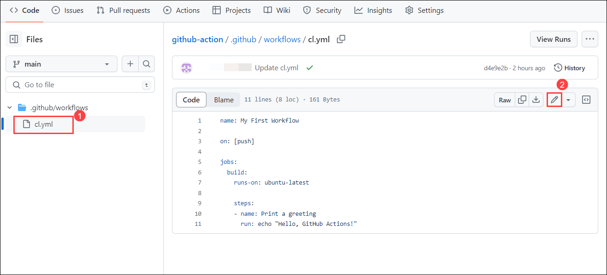

20. In the editor update the code with the below-provided code, replace **{DOCKERHUB_USERNAME}** **(2)** with you docker username in line number 17, replace **{DOCKERHUB_TOKEN}** **(3)** with Docker PAT line number 18, **{DOCKERHUB_USERNAME}** **(4)** with you docker username in line number 29 and click on **commit changes** **(5)**.

    ```
    name: ci
    
    on:
      push:
        branches:
          - "main"
    
    jobs:
      build:
        runs-on: ubuntu-latest
        steps:
          -
            name: Checkout
            uses: actions/checkout@v4
          -
            name: Login to Docker Hub
            uses: docker/login-action@v3
            with:
              username: ${{ secrets.DOCKERHUB_USERNAME }}
              password: ${{ secrets.DOCKERHUB_TOKEN }}
          -
            name: Set up Docker Buildx
            uses: docker/setup-buildx-action@v3
          -
            name: Build and push
            uses: docker/build-push-action@v5
            with:
              context: .
              file: ./docker
              push: true
              tags: ${{ secrets.DOCKERHUB_USERNAME }}/clockbox:latest
    ```

    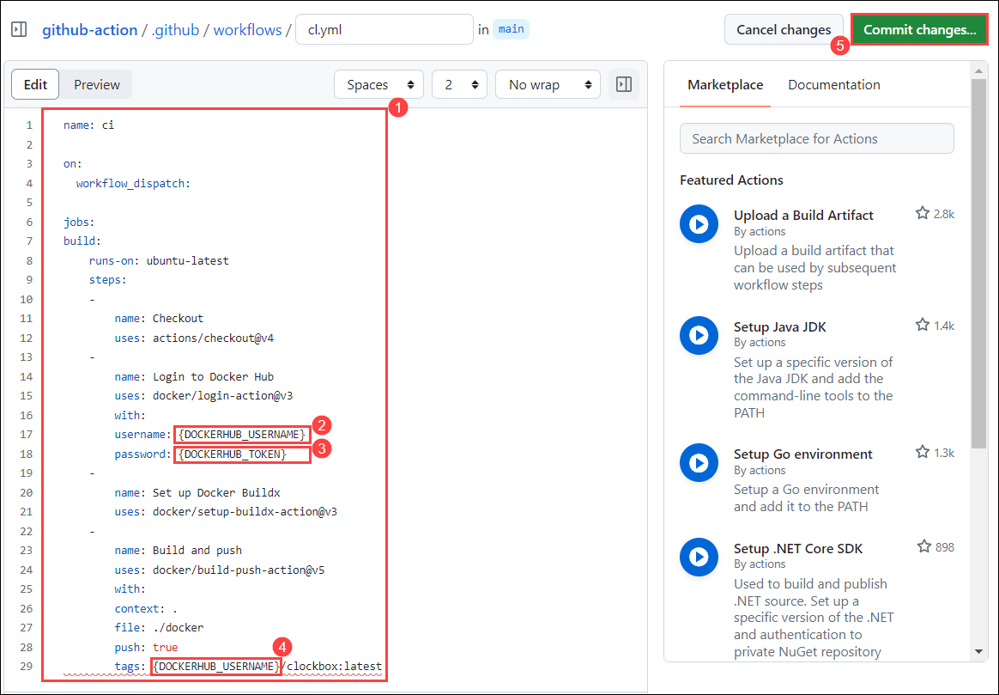

21. In the pop up windows of **Commit Changes** click on the **Commit changes**.

    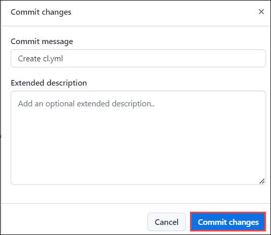

22. Click on **Action** **(1)**, verify the workflow has been executed successfully once the workflow is succedded select the newly created workflow **updated cl.yml** **(2)**.

    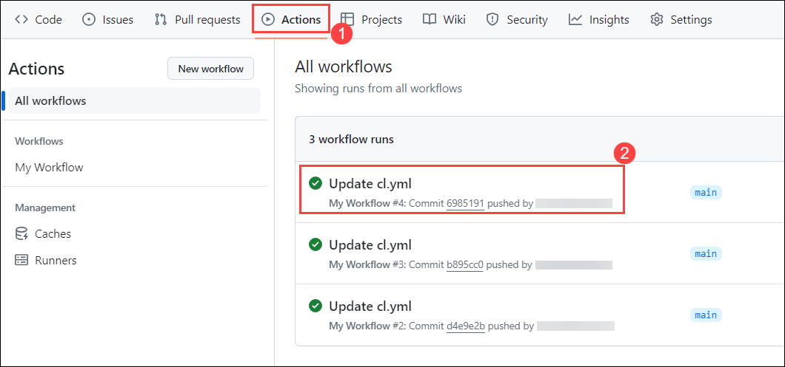

23. Navigate back to the Docker Hub and click on **Repositories** and cross verify the Repositorie has been created **successfully**.

    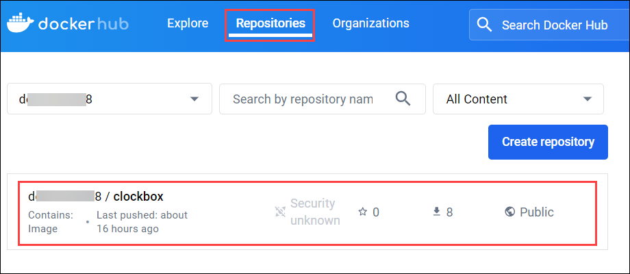

### Task 2: Using a third-party action to deploy a Docker container to a Azure platform (Read-Only).

In this task, you will learn how to use a third-party action to deploy a Docker hub container to an Azure platform. This involves setting up the action, configuring it to work with your Docker container, and deploying it to Azure.

1. Now let's create a workflow to publish into Docker Hub using GitHub action. Navigate to the **Code** **(1)**, click on **Add File** **(2)** and click on **+ Create new file** **(3)**.
    
    

2. Provider file name as **deploy-webapp.ps1** **(1)**, in the editor **copy and paste** **(2)** the below script, and click on **commit changes** **(3)**.

    ```
    [CmdletBinding()]
    param(
        [Parameter(Mandatory = $True)]
        [string]
        $azureSubscriptionName,

        [string]
        $resourceGroupNameRegion,

        [string]
        $serverName,

        [string]
        $adminLogin,
    
        [string]
        $deploymentid,

        [string]
        $DOCKERHUB_PASSWORD,

        [string]
        $DOCKERHUB_USERNAME,

        [string]
        $Username,

        [string]
        $Password
    )

    $MY_WEBAPP_NAME = "webapplication" + $deploymentid 
    $MY_RESOURCE_GROUP = "ODL-GitHub-Action-" + $deploymentid
    $MY_DOCKERHUB_PASSWORD = $DOCKERHUB_PASSWORD
    $MY_DOCKERHUB_USERNAME = $DOCKERHUB_USERNAME
    $MY_APP_SERVICE_PLAN = "webapplication" + $deploymentid

    Write-Output "Logging in to Azure with a service principal..."
    az login -u $Username -p $Password
    Write-Output "Done"
    Write-Output ""
    #endregion

    #region Subscription
    #This sets the subscription the resources will be created in

    Write-Output "Setting default azure subscription..."
    az account set `
        --subscription "$azureSubscriptionName"
    Write-Output "Done"
    Write-Output ""
    #endregion

    az appservice plan create --name $MY_APP_SERVICE_PLAN --sku 'B1' --resource-group $MY_RESOURCE_GROUP --is-linux

    az webapp create --resource-group $MY_RESOURCE_GROUP --plan $MY_APP_SERVICE_PLAN --name $MY_WEBAPP_NAME --deployment-container-image-name $MY_DOCKERHUB_USERNAME/clockbox:latest 

    az webapp config appsettings set --resource-group $MY_RESOURCE_GROUP --name $MY_WEBAPP_NAME --settings "DOCKER_REGISTRY_SERVER_USERNAME=$MY_DOCKERHUB_USERNAME" "DOCKER_REGISTRY_SERVER_PASSWORD=$MY_DOCKERHUB_PASSWORD"

    Write-Output "Done creating VM"
    Write-Output 
    ```

    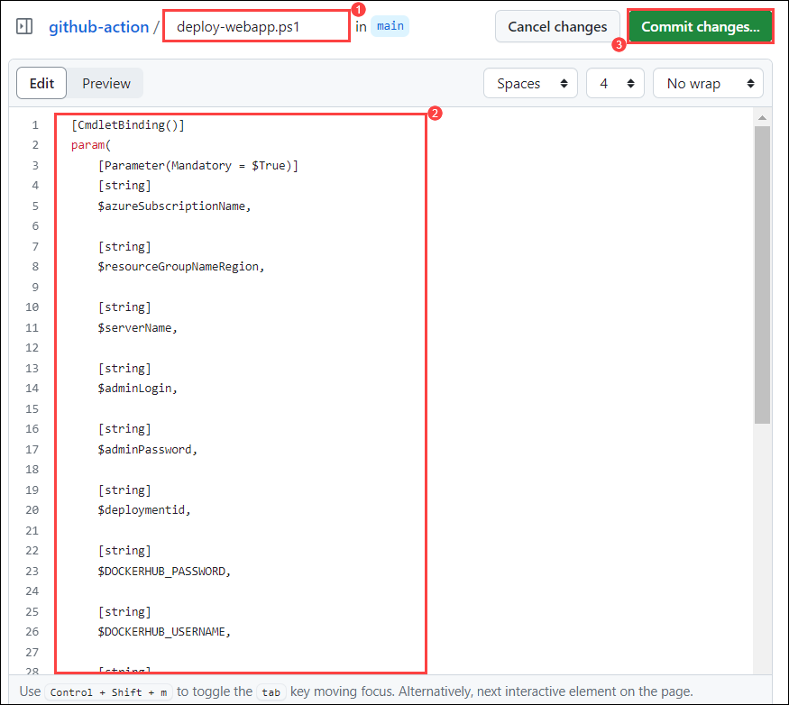

    > **Note**: This PowerShell script creates an Azure App Service plan, deploys a web app using a Docker image, and sets the Docker registry server username and password as app settings.

3. In the **Commit changes** pop-up, click on **Commit changes** button.

    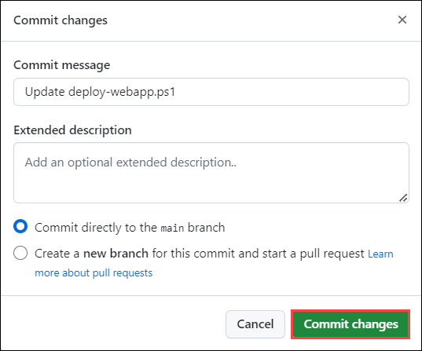

4. Navigate to the **Code** **(1)** and click on **.github/workflows** **(2)** folder.

    

5. In the **.github/workflows** folder, select **cl.yml** **(1)** and click on **edit** **(2)**.

    

6. Replace the following code with the below code.

    ```
    name: Deploying Azure Webapp
    
    env:
      OUTPUT_PATH: ${{ github.workspace }}
      DeploymentID: {Deployment_ID}
      RESOURCE_GROUP_REGION: eastus
      SERVER_NAME: gihtubactions
      ADMIN_LOGIN: {GitHub_Username}
      Username: {Azure_Login_ID}
      Password: {Azure_Login_Password}
      AZURE_SUBSCRIPTION_ID: {Azure_Subscription_ID}
      DOCKERHUB_USERNAME: {Dockerhub_Username}
      DOCKERHUB_PASSWORD: {Dockerhub_PAT}
    
    on:
      workflow_dispatch:
    
    jobs:
          
      # Deploying Azure Webapp
      DeployVM:
        runs-on: windows-latest
    
        steps:
        # Deploying Azure Webapp
        - name: checkout repo
          uses: actions/checkout@v1
    
        - name: look for ps1 file
          run: |
            ls '${{ env.OUTPUT_PATH }}'
        - name: Deploying Azure Webapp
          run: >
              powershell -command "& '${{ env.OUTPUT_PATH }}/deploy-webapp.ps1'"  
              -azureSubscriptionName ${{ env.AZURE_SUBSCRIPTION_ID }}
              -resourceGroupNameRegion ${{ env.RESOURCE_GROUP_REGION }}
              -serverName ${{ env.SERVER_NAME }} 
              -adminLogin ${{ env.ADMIN_LOGIN }}
              -deploymentid ${{ env.DeploymentID }}
              -DOCKERHUB_PASSWORD ${{ env.DOCKERHUB_PASSWORD }}
              -DOCKERHUB_USERNAME ${{ env.DOCKERHUB_USERNAME }}
              -Username ${{ env.Username }}
              -Password ${{ env.Password }}
    ```

    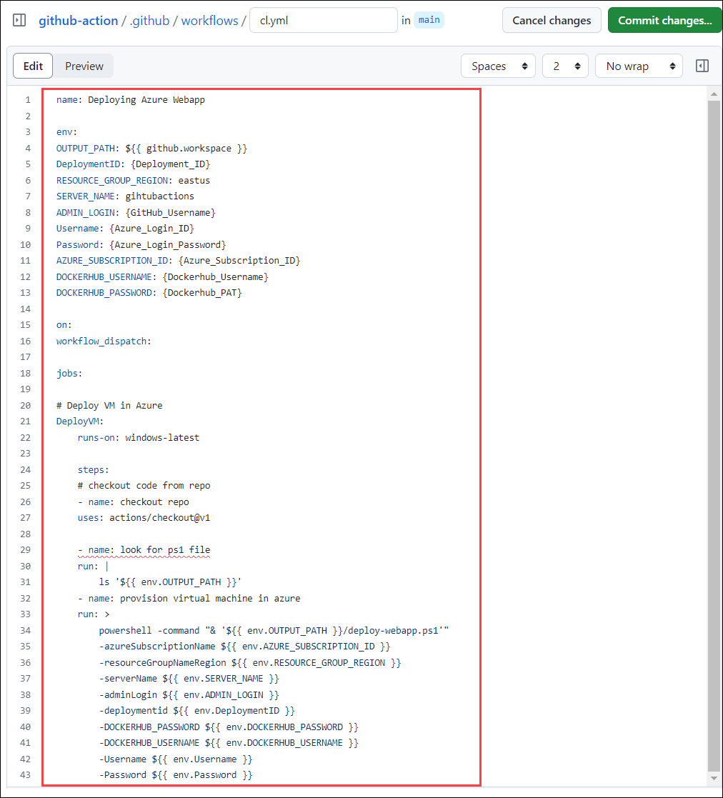

7. Replace the value and click on **commit changes** **(8)**.

    - **{Deployment_ID}** **(1)** with <inject key="Deployment ID">.
    - **{GitHub_Username}** **(2)** with your GitHub username.
    - **{Azure_Login_ID}** **(3)** with <inject key="AzureAdUserEmail"></inject>
    - **{Azure_Login_Password}** **(4)** with <inject key="AzureAdUserPassword"></inject>
    - **{Azure_Subscription_ID}** **(5)** with <inject key="SUBSCRIPTION_ID"></inject>
    - **{Dockerhub_Username}** **(6)** with your Docker Hub Username.
    - **{Dockerhub_PAT}** **(7)** with your Docket PAT which you coped on the previous task.

        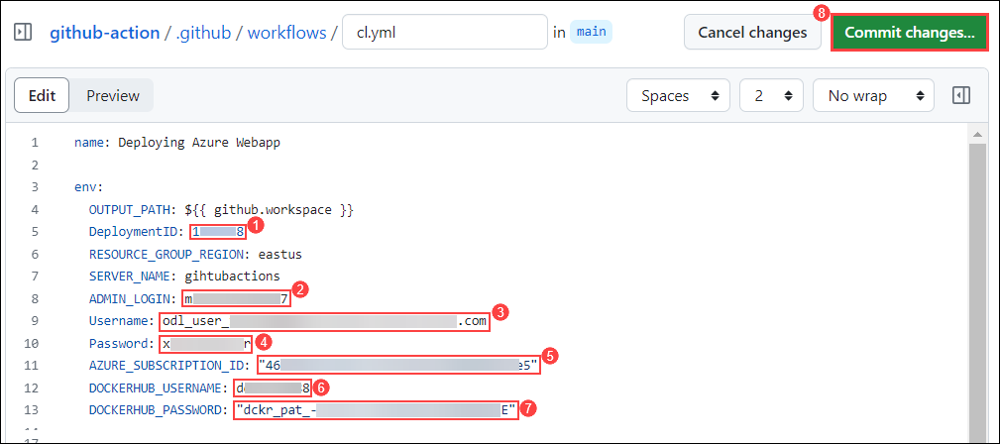

        > **Note**: If you seena warning pop-up **Secret scanning found a Azure Active Directory Application Secret secret**, select **I'll will fix it later** **(1)**, click on **Allow Secret** **(2)** and click on **commit changes** **(3)**.

        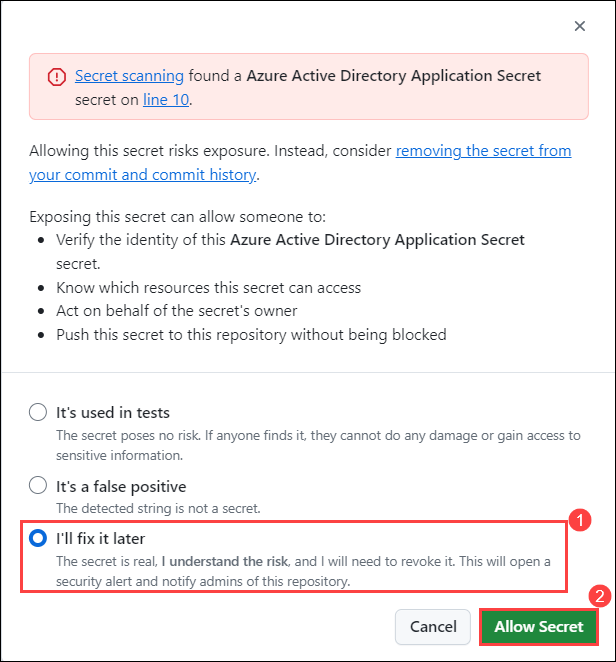    

8. In the pop up windows of **Commit Changes** click on the **Commit changes**.

    

9. Click on **Action** **(1)**, under worklows select **Deploying Azure Webapp** **(2)**, select **Run Workflow** **(3)** drop-down and click on **Run Workflow** **(4)** button.

    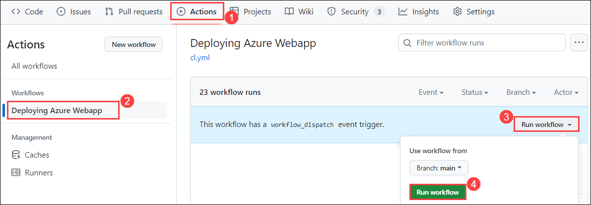

10. Once the workfow has succeeded click **Deploying Azure Webapp** workflow.

    

11. Go through the workflow one by one.

    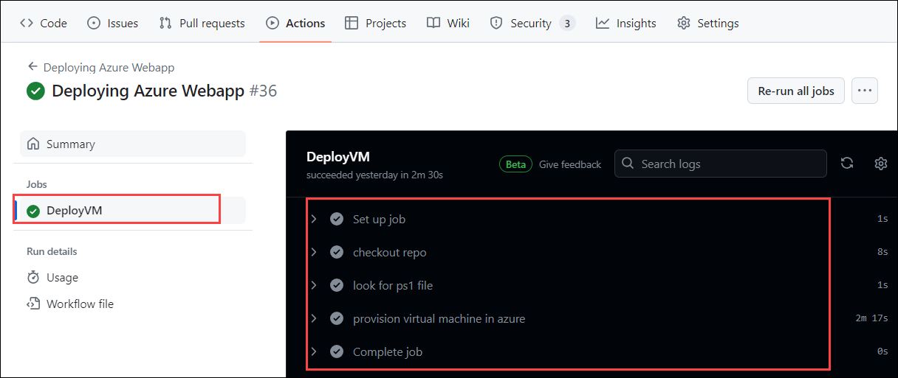

12. Naviagte back to the **Azure portal**, in the search bar search for **app service** (1) and select **App Services** **(2)**.
    
    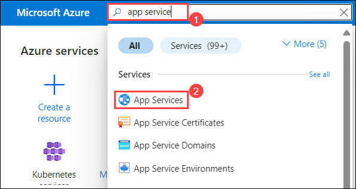

13. In the **App Services** tab, select **webapplication<inject key="deploymentid">**.

    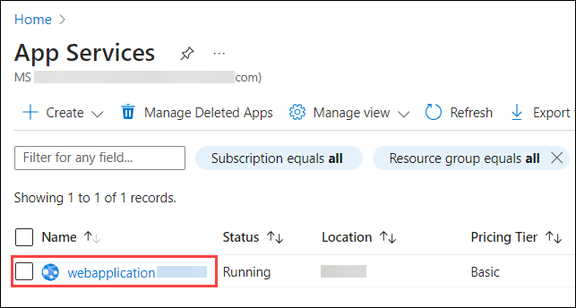

14. In the **webapplication<inject key="deploymentid">** tab, click on the **Browse** button this will open an website a new table.

    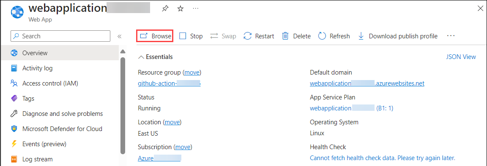

15. Now we can launch a Website using GitHub action and Docker Hub

    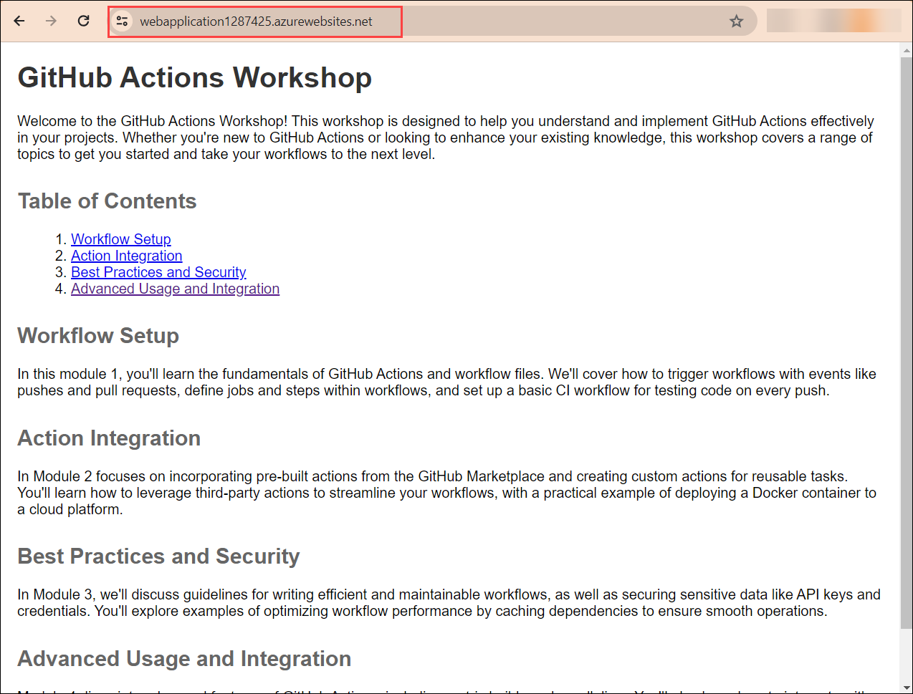

16. Click on **Next** button for next Lab.
