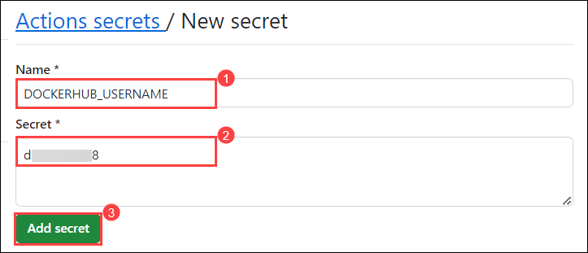
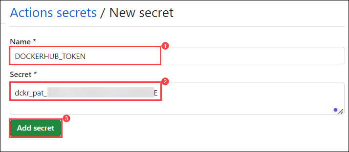
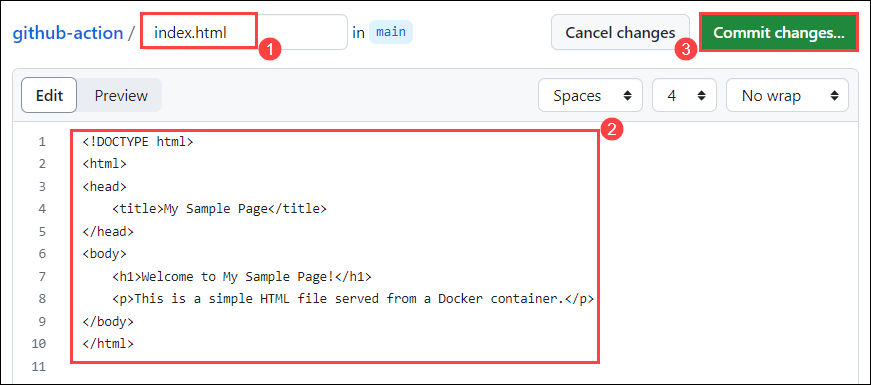

# Lab 3: Best Practices and Security 

### Task 1: Guidelines for writing efficient and maintainable workflows

### Task 2: Incorporating pre-built actions from the GitHub Marketplace

GitHub Marketplace is a central location for you to find actions created by the GitHub community. These actions can be incorporated into your workflows to automate common tasks without having to write the code yourself.

Here's how you can incorporate a pre-built action from the GitHub Marketplace:

1. In the Egde browser add a new tab and navigate `https://login.docker.com/u/login` page if you already having an Docker hub account **enter Username or email address** **(1)** and click on **Continue** **(2)**.

    

2. If you don't have account in the Docker Hub click on `sign up`.

    

3. In the sign up page of Docker Hub enter you **personal email id** **(1)**, proivde a unique **Username** **(2)**, provide a **Password** **(3)**, click on check box for **Send me occasional product updates and announcements** **(4)**, and click on **Sign Up** **(5)**. Perform Step 3

    

4. Enter the **Password** **(1)** and click on **Continue** **(2)**.

    

5. Login to the Personal Email and **Verify Email Address** send by docker.

6. In the Docker Hub tab click on **Profile** **(1)** and click on **My Account** **(2)**.

   

7. In the Docker Hub my account tab click on **Security** **(1)** and click on **New Access Token** **(2)**.

   

8. In **New Access Token** pop-up, enter the Access Token Description as **docker-demo** **(1)**, and click on **Generate** **(2)**.

    

9. In **Copy Access Token** pop-up, click on **Copy and Close** button and paste the coped access token in a notepad for future.

    

10. Navigate back to the `github-action` repo, from the GitHub repository,  select the **Settings** tab from the lab files repository.

    

11. Under **Security**, expand **Secrets and variables** **(1)** by clicking the drop-down and select **Actions** **(2)** blade from the left navigation bar. Select the **New repository secret** **(3)** button.

    

12. Under **Actions Secrets/New secret page**, enter the below mentioned details and Click on **Add secret** **(3)**.

    - Name : Enter **DOCKERHUB_USERNAME** **(1)**
    - Value : Enter the your **Username** **(2)** of Docker hub.

        

13. Once the secret has been created click on **Add secret**.

    

14. Under **Actions Secrets/New secret page**, enter the below mentioned details and Click on **Add secret** **(3)**.

    - Name : Enter **DOCKERHUB_TOKEN** **(1)**
    - Value : Enter the **PAT** **(2)** of Docker hub which you coped in Step 9.

        

15. **Find an Action**: Browse the [GitHub](https://github.com/marketplace?type=actions) Marketplace to find an action that suits your needs. You can search by keywords, categories, or use filters to narrow down the results.

16. In the **GitHub Marketplace**, in search bar search for **Build and push Docker images** **(1)** hit enter, select **Build and push Docker images** **(2)** and feel free to go throught the content.

    

    

17. Now lets create a workflow to publish into Docker Hub using GitHub action. Navigate to the **Code** **(1)**, click on **Add File** **(2)** and click on **+ Create new file** **(3)**.
    
    

18. Provider file name as **docker** **(1)**, in the editor **copy and paste** **(2)** the below script, and click in **commit changes** **(3)**.

    ```
    # Use an official Nginx runtime as a parent image
    FROM nginx:latest

    # Copy the HTML file to the Nginx container
    COPY index.html /usr/share/nginx/html

    # Make port 80 available to the outside of the Docker container
    EXPOSE 80

    # Start Nginx when the container launches
    CMD ["nginx", "-g", "daemon off;"]
    ```

    

19. Now lets create a workflow to publish into Docker Hub using GitHub action. Navigate to the **Code** **(1)**, click on **Add File** **(2)** and click on **+ Create new file** **(3)**.
    
    

20. Provider file name as **index.html** **(1)**, in the editor **copy and paste** **(2)** the below script, and click in **commit changes** **(3)**.

    ```
    <!DOCTYPE html>
    <html>
    <head>
        <title>My Sample Page</title>
    </head>
    <body>
        <h1>Welcome to My Sample Page!</h1>
        <p>This is a simple HTML file served from a Docker container.</p>
    </body>
    </html>
    ```

    

20. Navigate to the **Code** **(1)** and click on **.github/workflows** **(2)** folder.

    

21. In the **.github/workflows** folder, select **cl.yml** **(1)** and click on **edit** **(2)**.

    

22. In the editor update the code with the below provided code and click on and click on **commit changes** **(2)**.

    ```
    name: ci

    on:
    push:
        branches:
        - "main"

    jobs:
    build:
        runs-on: ubuntu-latest
        steps:
        -
            name: Checkout
            uses: actions/checkout@v4
        -
            name: Login to Docker Hub
            uses: docker/login-action@v3
            with:
            username: ${{ secrets.DOCKERHUB_USERNAME }}
            password: ${{ secrets.DOCKERHUB_TOKEN }}
        -
            name: Set up Docker Buildx
            uses: docker/setup-buildx-action@v3
        -
            name: Build and push
            uses: docker/build-push-action@v5
            with:
            context: .
            file: ./docker
            push: true
            tags: ${{ secrets.DOCKERHUB_USERNAME }}/clockbox:latest
    ```

    

23. In the pop up windows of **Commit Changes** click on the **Commit changes**.

    

24. Click on **Action** **(1)**, verifiy the workflow has been executed successfully once the workflow is succedded select the newly created workflow **updated cl.yml** **(2)**.

    

25. Naviagte back to the Docker Hub and click on **Repositories** and crossverify the Repositorie has been created **successfully**.

    

### Task 2: Using a third-party action to deploy a Docker container to a Azure platform.

1. 