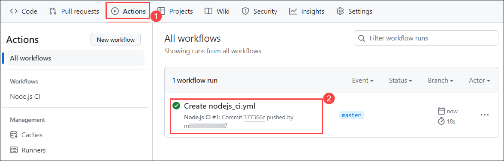

# Lab 3: Best Practices and Security 

### Task 1: Securing sensitive data like API keys and credentials

Securing sensitive data like API keys and credentials is crucial to protect your workflows and prevent unauthorized access. This can be achieved by using secrets, which are encrypted variables that can be securely used in your workflows without exposing the actual values.

1. Navigate back to the `github-action` repo, from the GitHub repository, and select the **Settings** tab from the lab files repository.

    

2. Under **Security**, expand **Secrets and variables** **(1)** by clicking the drop-down and select **Actions** **(2)** blade from the left navigation bar. Select the **New repository secret** **(3)** button.

    

3. Under **Actions Secrets/New secret page**, enter the below mentioned details and Click on **Add secret** **(3)**.

    - Name : Enter **DOCKERHUB_USERNAME** **(1)**
    - Value : Enter the your **Username** **(2)** of Docker hub.

        

4. Once the secret has been created click on **Add secret**.

    

5. Under **Actions Secrets/New secret page**, enter the below mentioned details and Click on **Add secret** **(3)**.

    - Name : Enter **DOCKERHUB_TOKEN** **(1)**
    - Secret : Enter the **PAT** **(2)** of Docker hub which you coped in Step 9.

        

6. Under **Actions Secrets/New secret page**, enter the below mentioned details and Click on **Add secret** **(3)**.

    - Name : Enter **AZURE_SUBSCRIPTION_ID** **(1)**
    - Secret : Enter the **<inject key="SUBSCRIPTION_ID">** **(2)**.

7. Under **Actions Secrets/New secret page**, enter the below mentioned details and Click on **Add secret** **(3)**.

    - Name : Enter **ADMIN_LOGIN** **(1)**
    - Secret : Enter the **GitHub Username** **(2)**.

8. Under **Actions Secrets/New secret page**, enter the below mentioned details and Click on **Add secret** **(3)**.

    - Name : Enter **Username** **(1)**
    - Secret : Enter the Azure User Email **<inject key="AzureAdUserEmail"></inject>** **(2)**.

9. Under **Actions Secrets/New secret page**, enter the below mentioned details and Click on **Add secret** **(3)**.

    - Name : Enter **Password** **(1)**
    - Secret : Enter the Azure Password **<inject key="AzureAdUserPassword"></inject>** **(2)**.

10. In the **.github/workflows** folder, select **cl.yml** **(1)** and click on **edit** **(2)**.

    

11. Replace the following code with the below code.

    ```
    name: Deploying Azure Webapp
    
    env:
      OUTPUT_PATH: ${{ github.workspace }}
      RESOURCE_GROUP_REGION: eastus
      SERVER_NAME: gihtubactions

    on:
      workflow_dispatch:
    
    jobs:
          
      # Deploying Azure Webapp
      DeployVM:
        runs-on: windows-latest
    
        steps:
        # Deploying Azure Webapp
        - name: checkout repo
          uses: actions/checkout@v1
    
        - name: look for ps1 file
          run: |
            ls '${{ env.OUTPUT_PATH }}'
        - name: Deploying Azure Webapp
          run: >
              powershell -command "& '${{ env.OUTPUT_PATH }}/deploy-webapp.ps1'"  
              -azureSubscriptionName ${{ secret.AZURE_SUBSCRIPTION_ID }}
              -resourceGroupNameRegion ${{ env.RESOURCE_GROUP_REGION }}
              -serverName ${{ env.SERVER_NAME }} 
              -adminLogin ${{ secret.ADMIN_LOGIN }}
              -deploymentid ${{ secret.DeploymentID }}
              -DOCKERHUB_PASSWORD ${{ secret.DOCKERHUB_PASSWORD }}
              -DOCKERHUB_USERNAME ${{ secret.DOCKERHUB_USERNAME }}
              -Username ${{ secret.Username }}
              -Password ${{ secret.Password }}
    ```

12. Now let's create a workflow to publish into Docker Hub using GitHub action. Navigate to the **Code** **(1)**, click on **Add File** **(2)** and click on **+ Create new file** **(3)**.
    
    

13. Provider file name as **deploy-webapp.ps1** **(1)**, in the editor **copy and paste** **(2)** the below script, and click on **commit changes** **(3)**.

    ```
    [CmdletBinding()]
    param(
        [Parameter(Mandatory = $True)]
        [string]
        $azureSubscriptionName,

        [string]
        $resourceGroupNameRegion,

        [string]
        $serverName,

        [string]
        $adminLogin,
    
        [string]
        $deploymentid,

        [string]
        $DOCKERHUB_PASSWORD,

        [string]
        $DOCKERHUB_USERNAME,

        [string]
        $Username,

        [string]
        $Password
    )

    $MY_WEBAPP_NAME = "webapplication" + $deploymentid 
    $MY_RESOURCE_GROUP = "GitHub-Action-" + $deploymentid
    $MY_DOCKERHUB_PASSWORD = $DOCKERHUB_PASSWORD
    $MY_DOCKERHUB_USERNAME = $DOCKERHUB_USERNAME
    $MY_APP_SERVICE_PLAN = "webapplication" + $deploymentid

    Write-Output "Logging in to Azure with a service principal..."
    az login -u $Username -p $Password
    Write-Output "Done"
    Write-Output ""
    #endregion

    #region Subscription
    #This sets the subscription the resources will be created in

    Write-Output "Setting default azure subscription..."
    az account set `
        --subscription "$azureSubscriptionName"
    Write-Output "Done"
    Write-Output ""
    #endregion

    az appservice plan create --name $MY_APP_SERVICE_PLAN --sku 'B1' --resource-group $MY_RESOURCE_GROUP --is-linux

    az webapp create --resource-group $MY_RESOURCE_GROUP --plan $MY_APP_SERVICE_PLAN --name $MY_WEBAPP_NAME --deployment-container-image-name $MY_DOCKERHUB_USERNAME/clockbox:latest 

    az webapp config appsettings set --resource-group $MY_RESOURCE_GROUP --name $MY_WEBAPP_NAME --settings "DOCKER_REGISTRY_SERVER_USERNAME=$MY_DOCKERHUB_USERNAME" "DOCKER_REGISTRY_SERVER_PASSWORD=$MY_DOCKERHUB_PASSWORD"

    Write-Output "Done creating VM"
    Write-Output 
    ```

    

    > **Note**: This PowerShell script creates an Azure App Service plan, deploys a web app using a Docker image, and sets the Docker registry server username and password as app settings.

14. In the **Commit changes** pop-up, click on **Commit changes** button.

    

15. Navigate to the **Code** **(1)** and click on **.github/workflows** **(2)** folder.

    


16. Click on **Action** **(1)**, under worklows select **Deploying Azure Webapp** **(2)**, select **Run Workflow** **(3)** drop-down and click on **Run Workflow** **(4)** button.

    

17. Once the workfow has succeeded click **Deploying Azure Webapp** workflow.

    

18. Go through the workflow one by one.

    

19. Naviagte back to the **Azure portal**, in the search bar search for **app service** (1) and select **App Services** **(2)**.
    
    

20. In the **App Services** tab, select **webapplication<inject key="deploymentid">**.

    

21. In the **webapplication<inject key="deploymentid">** tab, click on the **Browse** button this will open an website a new table.

    

22. Now we are able to launch a Website using GitHub action and Docker Hub

    

### Task 2: Guidelines for writing efficient and maintainable workflows

Guidelines for writing efficient and maintainable workflows help ensure that your workflows are optimized for performance and maintainability. This includes following best practices such as using parallel jobs, minimizing unnecessary steps, and organizing your workflow files effectively.

1. Naviagte to the [sample-node-project](https://github.com/acemilyalcin/sample-node-project) repo and click on **Fork** **(2)**.


2. Navigate to the **Action** **(1)** directory in your repository, in `Get started with GitHub Actions` click on set up a workflow yourself (2).

    

3. Provider file name as **nodejs_ci.yml** **(1)**, in the editor **copy and paste** **(2)** the below script, and click in **commit changes** **(3)**.

    ```
    name: Node.js CI
    
    on:
      push:
        branches:
          - master
          - dev
    jobs:
      build:
    
        runs-on: ubuntu-latest
    
        strategy:
          matrix:
            node-version: [18.x]
            # See supported Node.js release schedule at https://nodejs.org/en/about/releases/
    
        steps:
        - uses: actions/checkout@v3
        - name: Use Node.js ${{ matrix.node-version }}
          uses: actions/setup-node@v3
          with:
            node-version: ${{ matrix.node-version }}
            cache: 'npm'
    ```

    

4. In the **Commit changes** pop-up, click on **Commit changes** button.

    

5. Click on **Action** **(1)**, verify the workflow has been executed successfully once the workflow is succedded select the newly created workflow **Create nodejs_ci.yml** **(2)**.

    

    > Feel free to go through the workflow


### Task 3: Optimizing workflow performance by caching dependencies

Optimizing workflow performance by caching dependencies can significantly improve the execution time of your workflows. By caching dependencies, you can avoid unnecessary downloads and installations, resulting in faster and more efficient workflows.

- **Identify Dependencies**: Determine which dependencies in your project take a long time to install.
- **Add Cache Step**: In your GitHub Actions workflow file, add a step that uses the `actions/cache@v2` action.
- **Configure Cache Key**: Set the `key` to an expression that uniquely identifies each set of dependencies. This typically includes the package manager's lock file.
- **Specify Path**: Set the `path` to the directory where dependencies are installed.
- **Restore Cache**: If a cache hit occurs, the action restores the cached dependencies.

1. 
