# Lab 4: Advanced Usage and Integration 

### Task 1: Utilizing advanced features like matrix builds and parallelism

Matrix builds and parallelism are advanced features in GitHub Actions that allow you to run multiple jobs concurrently.

Matrix builds let you test your code across multiple environments by creating a job matrix. This is a set of keys and values that create a combination of conditions and run a job for each one.

Parallelism allows you to run jobs or steps concurrently, reducing the total execution time.

1. Navigate to the **Code** **(1)** and click on **.github/workflows** **(2)** folder.

    

2. In the **.github/workflows** folder, select **nodejs_ci.yml** **(1)** and click on **edit** **(2)**.

    

3. Replace the following code with the below code.

```
name: Node.js CI

env:
  OUTPUT_PATH: ${{ github.workspace }}

on:
  push:
    branches:
      - master
      - dev

jobs:
  build:
    runs-on: ubuntu-latest

    strategy:
      matrix:
        node-version: [18.x]

    steps:
      - uses: actions/checkout@v3

      - name: Cache Node.js dependencies
        uses: actions/cache@v2
        with:
          path: ~/.npm
          key: ${{ runner.os }}-node-${{ matrix.node-version }}-${{ hashFiles('${{ env.OUTPUT_PATH }}/package-lock.json') }}
          restore-keys: |
            ${{ runner.os }}-node-${{ matrix.node-version }}-

      - name: Use Node.js ${{ matrix.node-version }}
        uses: actions/setup-node@v3
        with:
          node-version: ${{ matrix.node-version }}
```

4. In the pop up windows of **Commit Changes** click on the **Commit changes**.

    

5. Click on **Action** **(1)**, verify the workflow has been executed successfully once the workflow is succedded select the newly created workflow **Create nodejs_ci.yml** **(2)**.

    

    > Feel free to go through the workflow

### Task 2: Integrating with GitHub features issue tracking

GitHub Actions can be integrated with GitHub's issue tracking to automate certain workflows. For instance, you can set up a workflow to automatically respond to new issues, label issues based on their content, or even close stale issues.

1. Navigate to your GitHub account, from the upper-right corner of the page, click your **profile** icon.

   

2. From the GitHub account settings pop-up click on **Setting**.
   
   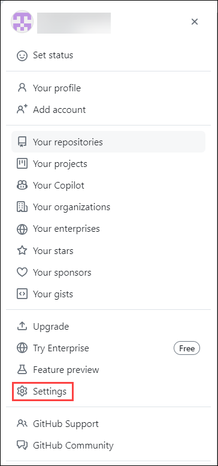

3. From the left menu scroll down and select the **Developer settings**.

    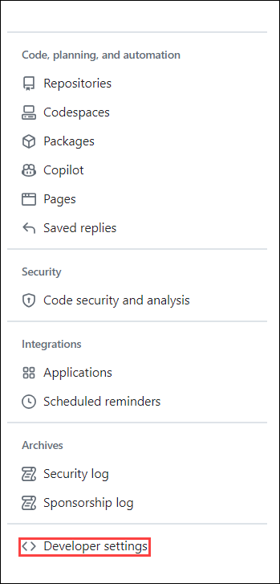

4. In the **Developer settings** tab, expand **Personal access token** **(1)**, and click-on **Token (Classic)** **(2)**. In the **Personal access tokens (classic)**, click-on the **Generate new token** **(3)** drop-down and select **Generate new token (classic)** **(4)**.

    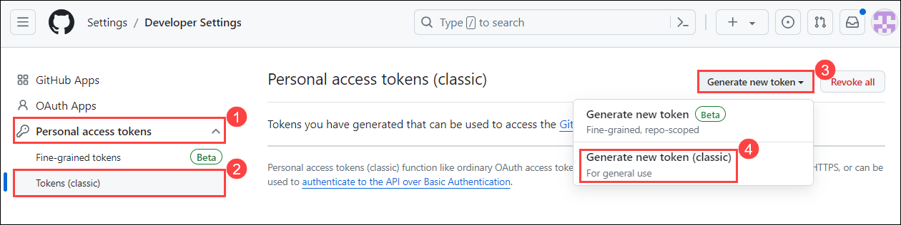

5. In the **personal access token (classic)** tab enter the fallowing details and click on **Generate token** **(6)**.

    - **Note**: enter the not as **pat** **(1)**.
    - **Expiration**: From the drop-down select **7 days** **(2)**.
    - **Select scopes**: check box the fallowing scope **repo** **(3)**, **delete:packages** **(4)** and **admin:org** **(5)**.

      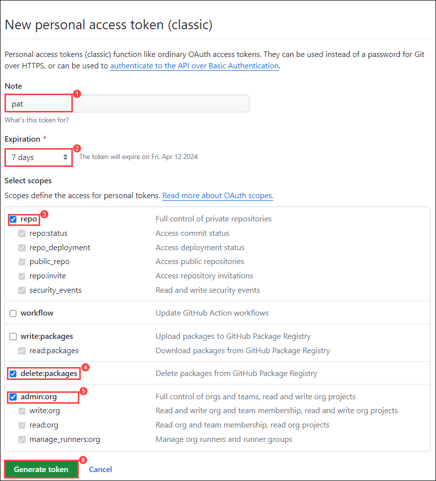

6. Copy the newly **generated personal access token(PAT)** into a notepad for future use.

    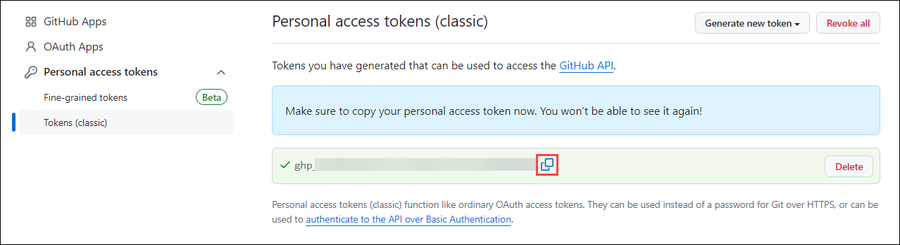

7. Navigate back to the `github-action` repo, from the GitHub repository, and select the **Settings** tab from the lab files repository.

    

8. Under **Security**, expand **Secrets and variables** **(1)** by clicking the drop-down and select **Actions** **(2)** blade from the left navigation bar. Select the **New repository secret** **(3)** button.

    

9. Under **Actions Secrets/New secret page**, enter the below mentioned details and Click on **Add secret** **(3)**.

    - Name : Enter **PAT_TOKEN** **(1)**
    - Value : Enter the **personal access token** **(2)** which you coped the step 6.

      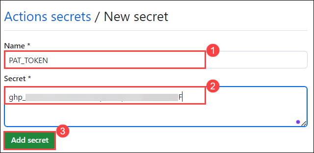

10. Navigate to the **Code** **(1)**, and click on **.github/workflows** **(2)** folder.

    

11. In the **.github/workflows** folder, click on **Add file** **(1)** from the drop down select **+ Create new file** **(2)**.

    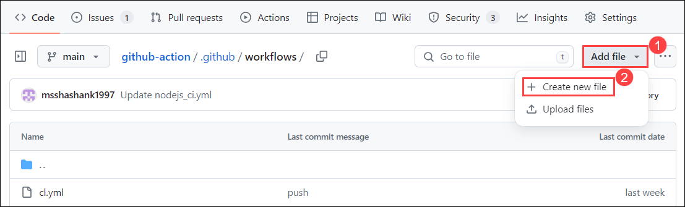

12. Enter the File name as **issue-repoted.yml** **(1)**, paste the fallowing code in the **codespace** **(2)** and click on **Commit changes** **(3)**.

```
name: Issue Response

on:
  issues:
    types: [opened]

jobs:
  respond:
    runs-on: ubuntu-latest
    steps:
    - name: Respond to issue
      uses: actions/github-script@v3
      with:
        github-token: ${{secrets.PAT_TOKEN}}
        script: |
          const issueComment = `Thank you for opening an issue. We will get back to you soon!`;
          github.issues.createComment({
            issue_number: context.issue.number,
            owner: context.repo.owner,
            repo: context.repo.repo,
            body: issueComment
          });
```

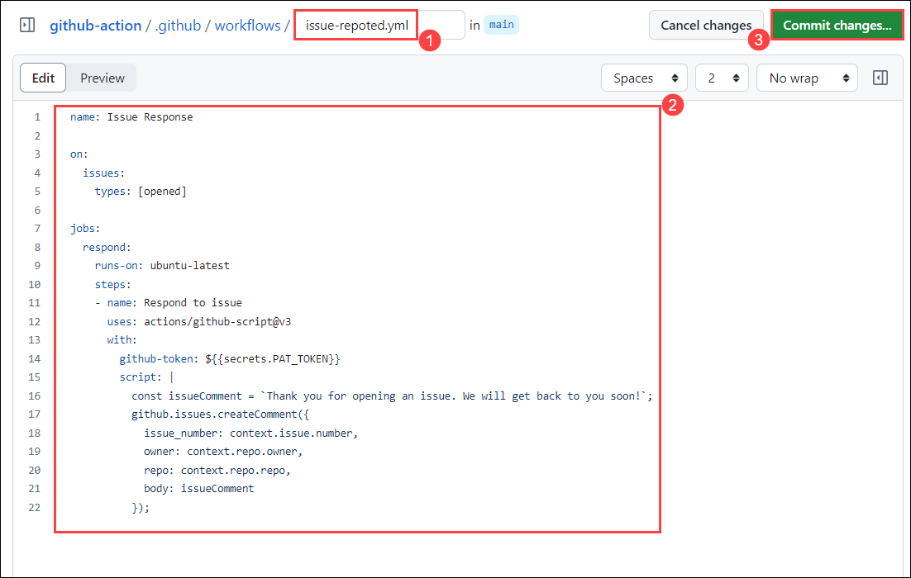

13. In the pop up windows of **Commit Changes** click on the **Commit changes**.

    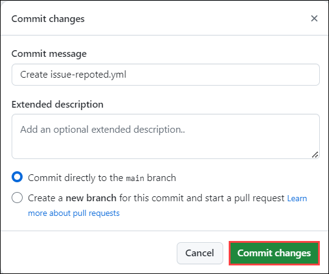

14. Now lets create a issue to trigger the workflow. In the `github-action` repo click on **issues** **(1)** and click on **New issue** **(2)**.

    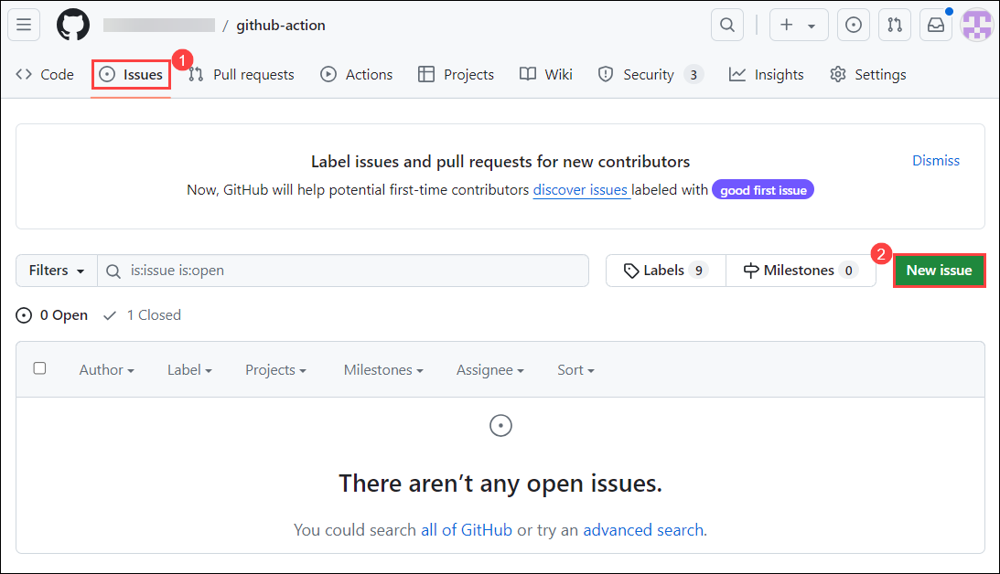

15. In the **Issue** tab, provide title as **docker push workflow is getting falied** **(1)**, discription as **docker push workflow is getting falied** **(2)**and click on **Submit new issue** **(3)**.

    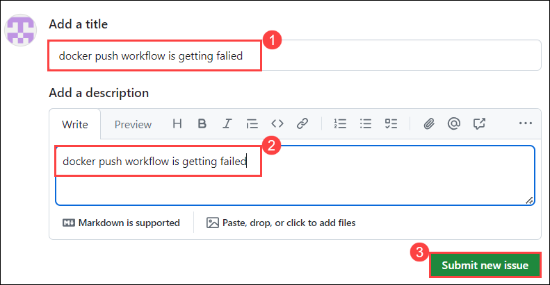

16. Naviagte back to the **Action** tab and review the workflow is getting succedded.

    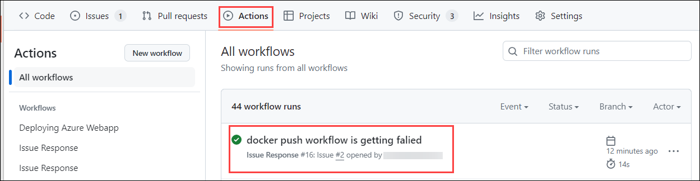

17. Naviagte back to the **issues** tab and select the **recently created issue**.

    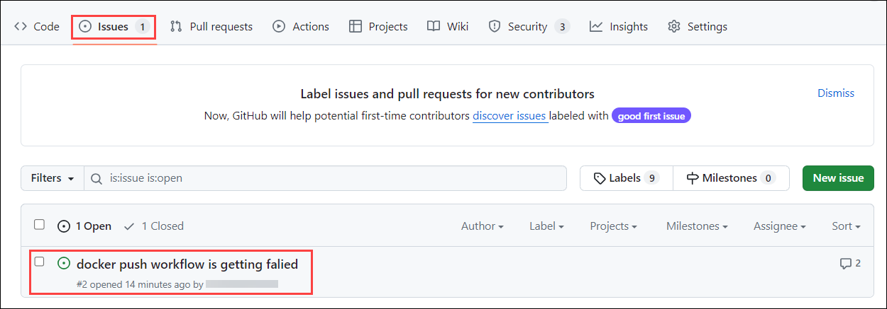

18. We can view the auto response to created issue.

    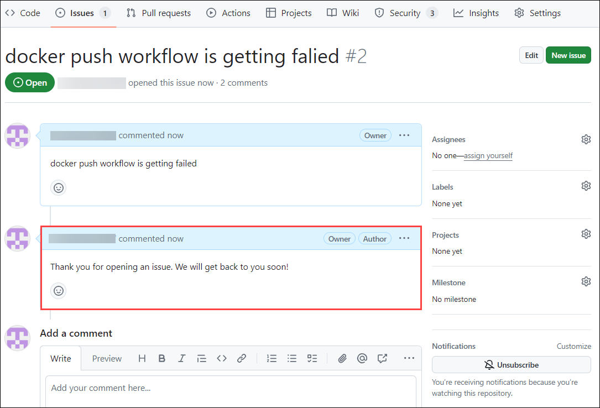

### Task 3: Setting up a matrix build to test across different operating systems and versions