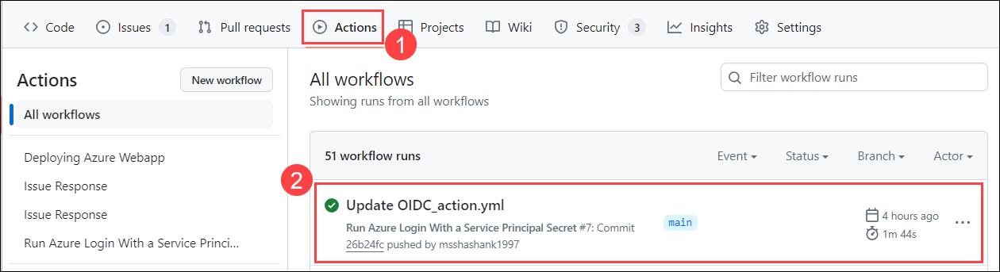

# Lab 4: Security and Best practices

### Task 1: OIDC to securely connect to the cloud

OpenID Connect (OIDC) allows your GitHub Actions workflows to access resources in Azure, without needing to store the Azure credentials as long-lived GitHub secrets. This gives an overview of how to configure Azure to trust GitHub's OIDC as a federated identity, and includes a workflow example for the azure/login action that uses tokens to authenticate to Azure and access resources.

1. Navigate back to the `github-action` repo, from the GitHub repository, and select the **Settings** tab from the lab files repository.

    

2. Under **Security**, expand **Secrets and variables** **(1)** by clicking the drop-down and select **Actions** **(2)** blade from the left navigation bar.

   

3. Under **Actions Secrets/New secret page**, enter the below mentioned details and Click on **Add secret** **(3)**.

   

4. Navigate to **Environment Details** **(1)**, click on **Service Principal Details** **(2)** and copy the **Subscription ID**, **Tenant Id (Directory ID)**, **Application Id(Client Id)** and **Secret Key (Client Secret)**.

   
   
   - Replace the values that you copied in below Json. You will be using them in this step.
   
      ```json
      {
        "clientSecret": "******",
        "subscriptionId": "******",
        "tenantId": "******",
        "clientId": "******"
      }
      ```

5. Under Actions Secrets/New secret page, enter the below mentioned details and Click on Add secret (3).

   - Name : Enter **AZURE_CREDENTIALS** (1)
   - Value : Paste the service principal details in json format (2)

     

6. Navigate to the **Code** **(1)** and click on **.github/workflows** **(2)** folder.

   

7. In the **.github/workflows** folder, click on **Add files** **(1)**, and click on **+ Create new file** **(2)**.

   

8. Provider file name as **OIDC_action.yml** **(1)**, in the editor **copy and paste** **(2)** the below script, and click in **commit changes** **(3)**.

    ```
    # File: .github/workflows/workflow.yml 
    
    on: [push]
    
    name: Run Azure Login With a Service Principal Secret
    
    jobs:
    
      build-and-deploy:
        runs-on: ubuntu-latest
        steps:
    
        - uses: azure/login@v2
          with:
            creds: ${{ secrets.AZURE_CREDENTIALS }}
            enable-AzPSSession: true
    
        - name: Azure CLI script
          uses: azure/cli@v2
          with:
            azcliversion: latest
            inlineScript: |
              az account show
    
        - name: Azure PowerShell script
          uses: azure/powershell@v2
          with:
            azPSVersion: "latest"
            inlineScript: |
              Get-AzContext
    ```

9. Click on **Action** **(1)**, verifiy the workflow has been executed successfully.

   

### Task 2: Agent infrastructure


