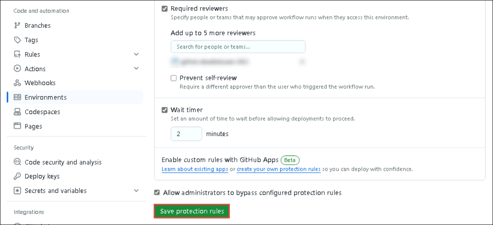
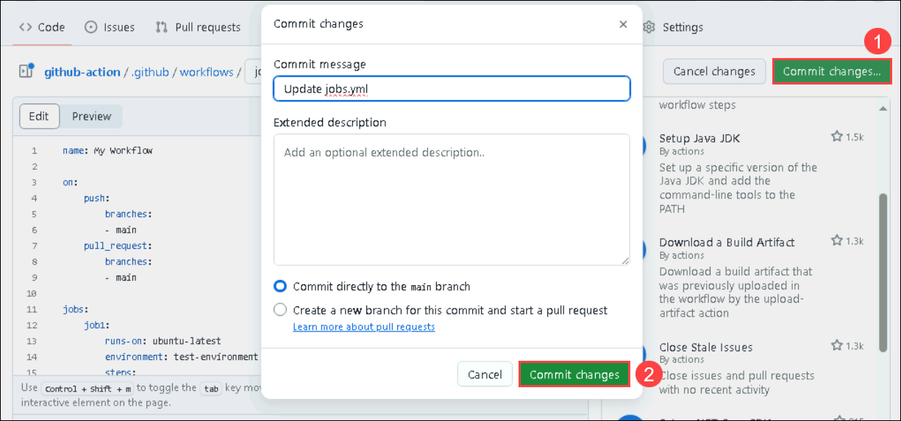
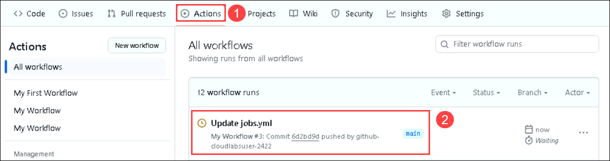
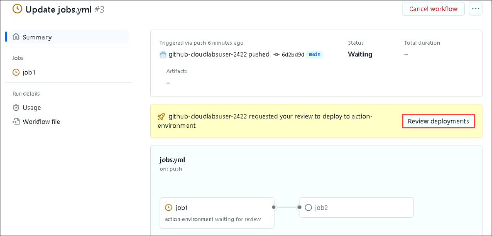
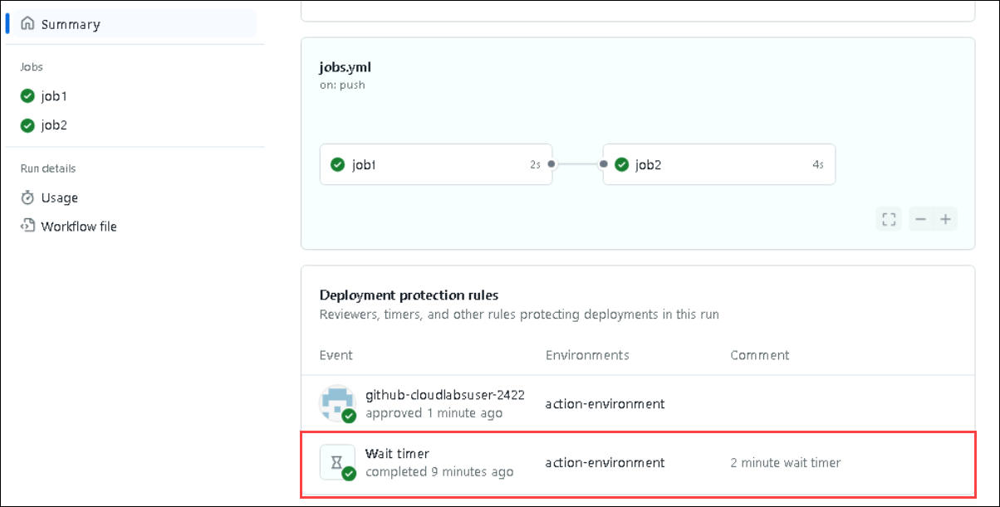

# Create Environment

In this exercise, You'll learn how to set up environments with protection rules and secrets. A workflow job that references an environment must adhere to these protection rules before it can run or access the environment's secrets.

## set up Environment

1. From GitHub, navigate to **Settings (1)** tab, select **Envrionments (2)**, and click on **New Environment (3)**.

    

1. Follow the below steps and create the enviornment. 
   - Provide name as **action environment** and click on **configure environment**.
   - In the Deployment protection rules section, check **Required reviewers** option, search the GitHub username and add the user. You can find the username in the GitHub homepage.
   - Enable **Wait timer** option and set it to 2 minutes.
   

1. Click on **Save protection rules** and save the environment.
   

1. From GitHub home page, navigate to `.github/workflows/jobs.yml` file and update the script as below.

   ```
   name: My Workflow
   
   on:
       push:
           branches:
           - main
       pull_request:
           branches:
           - main
   
   jobs:
       job1:
           runs-on: ubuntu-latest
           environment: test-environment
           steps:
           - name: Checkout code
             uses: actions/checkout@v2
       
           - name: Run a script
             run: echo "Hello, world!"
       
       job2:
           runs-on: ubuntu-latest
           needs: job1
           steps:
           - name: Checkout code
             uses: actions/checkout@v2
       
           - name: Run another script
             run: echo "Hello, again!"
   ```
   

1. Once you have updated the workflow file, commit the changes.

   

1. Navigate to Actions tab and select the **update jobs.yml** action.

   

1. You'll be able to see a request for approval as the github username was added in the previous steps. Click on **Review deployments**.

   

1. In the Review pending deployments pop window, select the **action-environment** and click on **Approve and deploy**.

   

1. You will also be able to see the **wait timer** status that job1 waited for 2 minutes before starting the execution.

   

In this exercise, you set up GitHub Environment and verified using Reviewer accound and Wait timer feature.

