# Lab 4: GitHub Environment

GitHub environments are a feature in GitHub Actions that allow you to define and manage different deployment environments, such as development, staging, and production. Environments can include protection rules like required reviewers, wait times, and environment-specific secrets to enhance security and control. This feature helps ensure that deployments are carried out in a controlled and consistent manner, providing safeguards and configurable policies for each stage of your deployment process.

In this exercise, you'll learn how to set up environments with protection rules, wait timers, environment secrets, and variables. A workflow job that references an environment must adhere to these protection rules before it can run or access the environment's secrets.

## Task 1: Set up Environment

In this task, you'll set up a GitHub environment and use it as a GitHub action.

1. From GitHub, navigate to the **Settings (1)** tab, select **Environments (2)**, and click on **New Environment (3)**.

   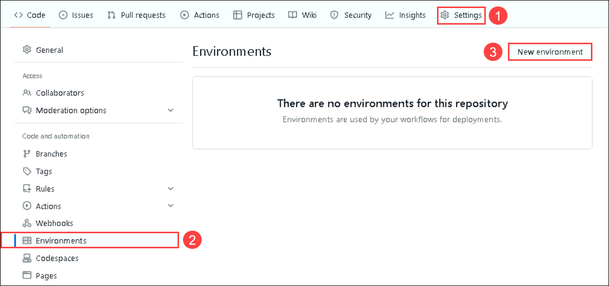 

1. Follow the below steps and create the environment. 

**Required Reviewers**
   - Provide the name as **action-environment** and click on **configure environment**.

   - In the Deployment protection rules section, check the **Required reviewers** option, search for the GitHub username, and add the user. You can find the username on the GitHub homepage.

**Wait Timer**
   - Enable the **Wait timer** option and set it to 2 minutes.

     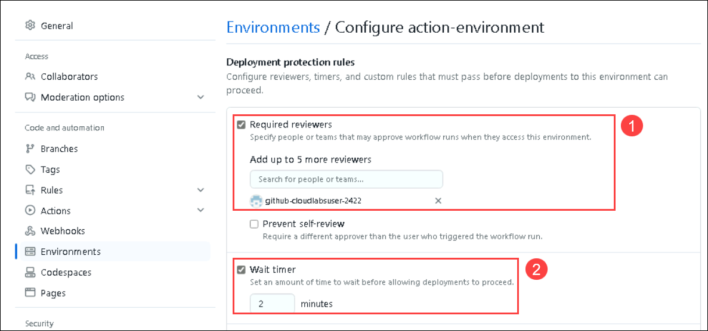

   - Now, scroll down to **Environment Secrets** and click on **Add environment secret**.

     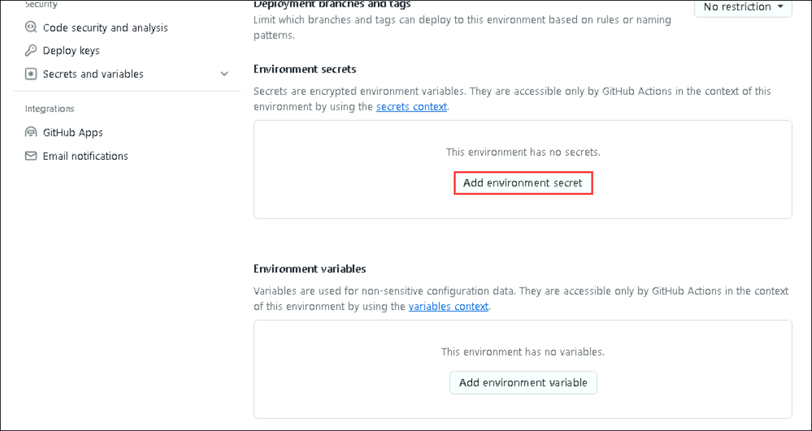

   - Click on **Save protection rules** to save the rules.

     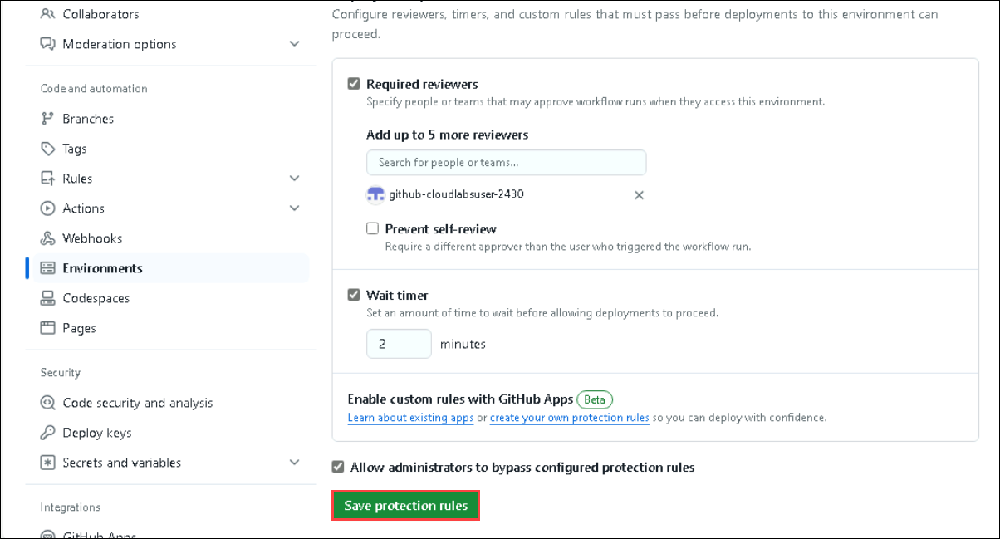

   **Environment Secrets**

   - Under the **Actions Secrets/New secret** page, enter the below-mentioned details and click on **Add secret (3)**.

   - Copy and paste the code below in the value section.
   
      ```json
      {
        "clientSecret": "******",
        "subscriptionId": "******",
        "tenantId": "******",
        "clientId": "******"
      }
      ```

   - Navigate to **Environment Details** **(1)**. Click on **Service Principal Details** **(2)** and copy the **Subscription ID**, **Tenant Id (Directory ID)**, **Application Id (Client Id)** and **Secret Key (Client Secret)**.

     

   - Name: Enter **AZURE_CREDENTIALS** **(1)**
   - Value: Paste the service principal details in **JSON format (2)**. Click on **Add secret**.

     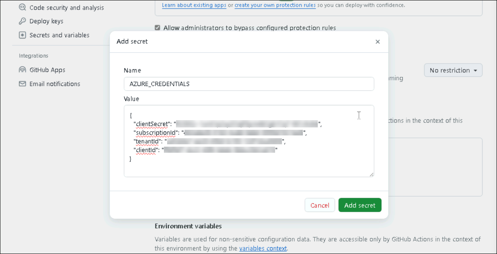

**Environment Variable**

   - Navigate to the **Azure portal** and select your container instance **gacontainer<inject key="DeploymentID" enableCopy="false"/>**, which you deployed in the earlier exercise.

   - Click on **Access Keys** **(1)** on the left pane under the **Settings** tab and copy the **Registry name** **(2)** and **Login server** **(3)** into a notepad.

     

   - Navigate back to GitHub. Under the **Environment variable** section, click on **Add environment variable**.
   
     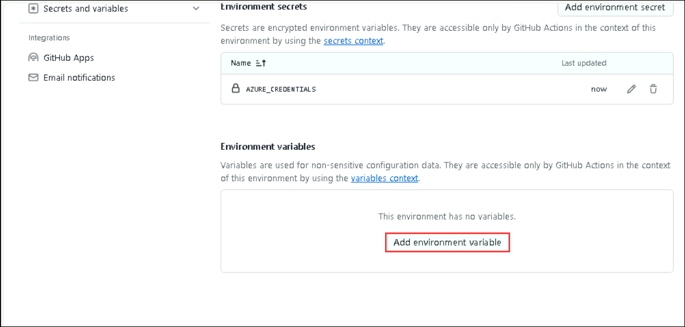

   - Provide the name as **REGISTRY_NAME (1)**, paste the **value** you copied from in earlier steps, and click on **Add Variable**.

     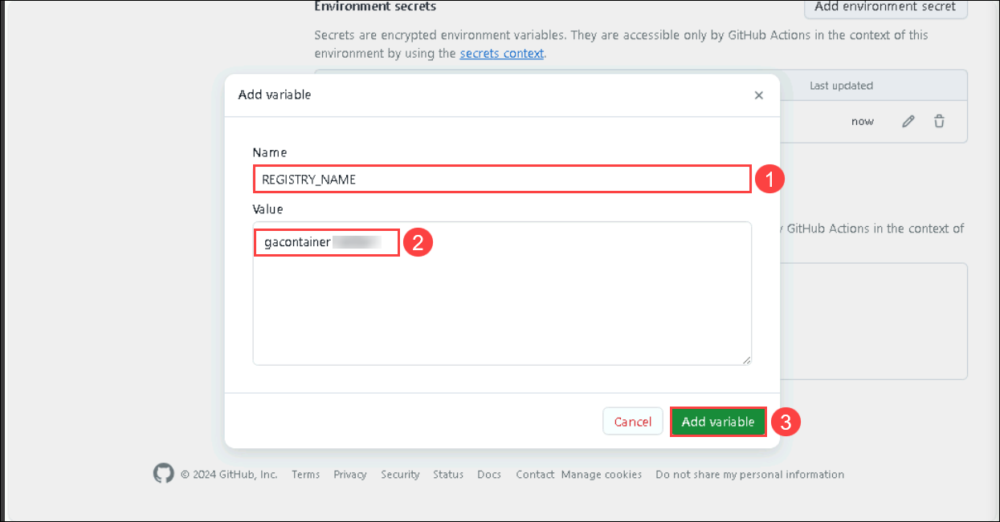

   - Similarly, click again on the **Add environment variable**. Provide the name as **LOGIN_SERVER** and paste the login server value copied in earlier steps.

     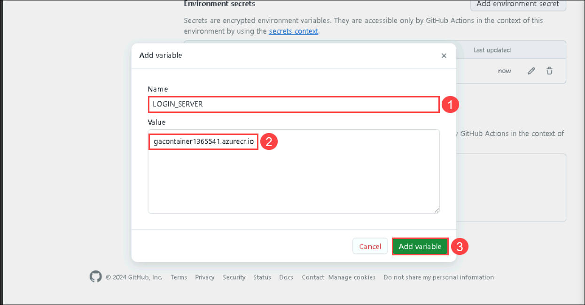

   - Please make sure that you have completed all the steps for creating a GitHub Environment. 

**Creating Workflow with the Environment**

1. Visit the GitHub home page, navigate to `.github/workflows/docker.yml` file, and update the script as provided below.

    ```
    name: Build and Push Docker Image to ACR
    
    on:
      push:
        branches:
          - main
        paths:
          - '.github/workflows/docker.yml'
      pull_request:
        branches:
          - main
        paths:
          - '.github/workflows/docker.yml'
      workflow_dispatch:
    
    jobs:
      build-and-push:
        environment: action-environment
        runs-on: ubuntu-latest
    
        steps:
        # Checkout the repository
        - name: Checkout repository
          uses: actions/checkout@v2
    
        # Log in to Azure
        - name: Log in to Azure CLI
          uses: azure/login@v1
          with:
            creds: ${{ secrets.AZURE_CREDENTIALS }}
    
        # List files in the current directory
        - name: List files
          run: ls -la
    
        # Build Docker image
        - name: Build Docker image
          env: 
            LOGIN_SERVER: ${{ vars.LOGIN_SERVER }}
          run: |
            docker buildx build . -t $LOGIN_SERVER/my-app:latest
    
        # Log in to Azure Container Registry
        - name: Log in to Azure Container Registry
          env:
            REGISTRY_NAME: ${{ vars.REGISTRY_NAME }}
          run: |
            az acr login --name $REGISTRY_NAME
    
        # Push Docker image to Azure Container Registry
        - name: Push Docker image
          env:
            LOGIN_SERVER: ${{ vars.LOGIN_SERVER }}
          run: |
            docker push $LOGIN_SERVER/my-app:latest
    ```

1. Once you have updated the workflow file, commit the changes.

   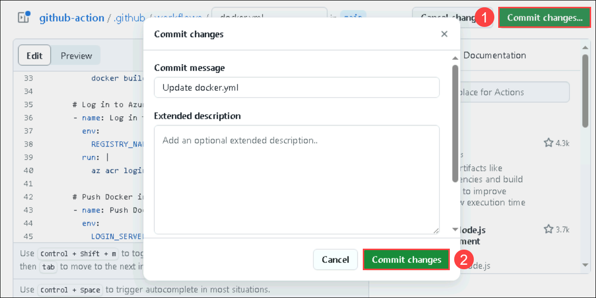

1. Navigate to the Actions tab and select the **update docker.yml** action.

   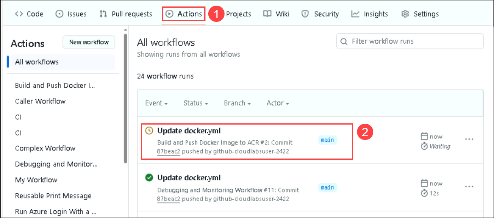

1. You'll be able to see a request for approval as the GitHub username was added in the previous steps. Click on **Review deployments**.

   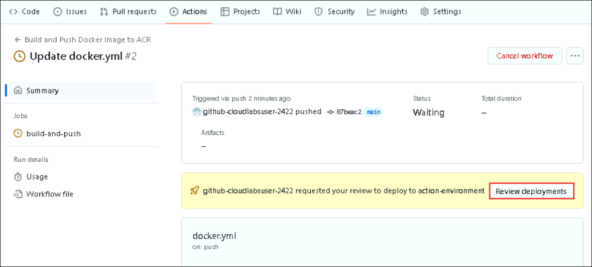

1. In the **Review pending deployments** pop-up window, select the **action-environment** and click on **Approve and deploy**.

   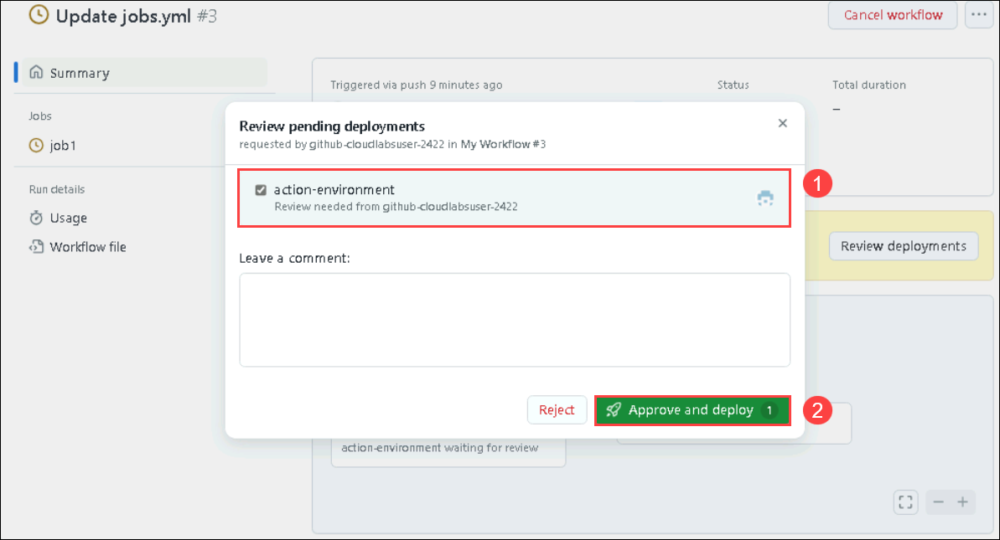

1. You will also be able to see the **wait timer** status, i.e., job1 waited for 2 minutes before starting the execution.

   

1. You can also notice the environment variables and secret values defined in the Environment are fetched and are used in the execution.

### Summary

In this lab, you learned about setting up GitHub Environment and verified using Reviewer account, Wait timer, Environment variables, and secrets.

