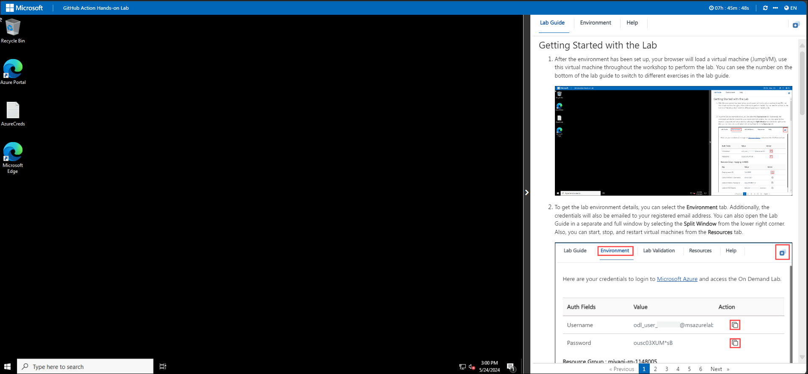
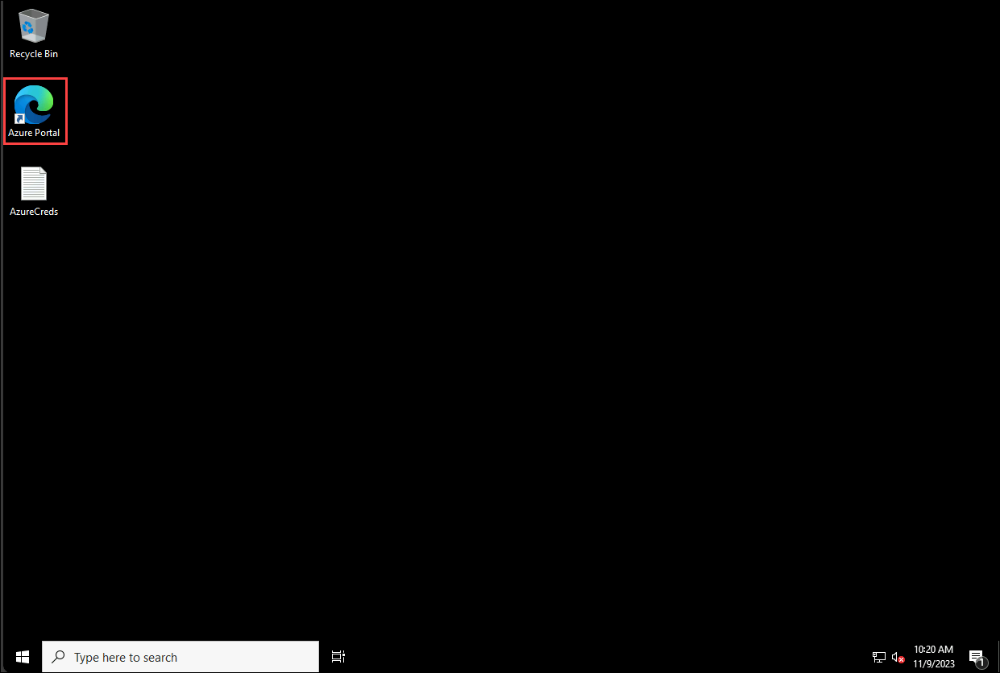
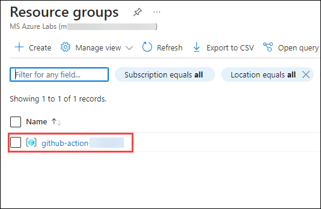
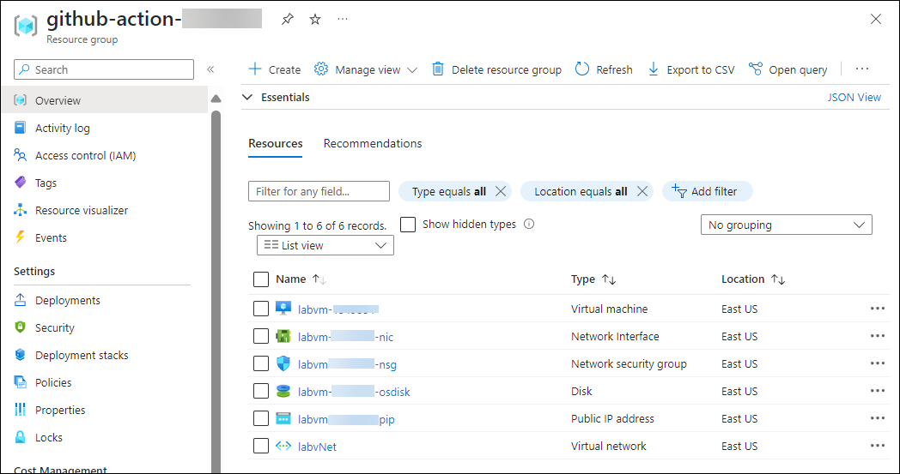

## Getting Started with the Lab

1. After the environment has been set up, your browser will load a virtual machine (JumpVM). Use this virtual machine throughout the workshop to perform the lab. You can see the number on the bottom of the lab guide to switch to different exercises in the lab guide.

   
 
1. To get the lab environment details, click on the **Environment** tab. Additionally, the credentials will also be emailed to your registered email address. You can open the Lab Guide in a separate and full window by selecting the **Split Window** option from the lower right corner. Also, you can start, stop, and restart virtual machines from the **Resources** tab.

    
   
   > Check out the **SUFFIX** value on the **Environment** tab. Use it wherever you see **SUFFIX** or **DeploymentID** in lab steps.
 
## Login to the Azure Portal

1. In the **JumpVM**, click on the **Azure portal shortcut** of the Microsoft Edge browser, which is created on the desktop.

   

1. On the **Sign in to Microsoft Azure** tab, you will see the login screen. Enter the email or username, and click on **Next**. 

   * **Email/Username**: **<inject key="AzureAdUserEmail"></inject>**

     
     
1. Now enter the password and click on **Sign in**.
   
   * **Password**: **<inject key="AzureAdUserPassword"></inject>**

     
   
1. If you see the pop-up **"Stay Signed in?"** Select **No**.

   

1. If a **Welcome to Microsoft Azure** pop-up window appears, select **Cancel** to skip the tour.

    
   
1. Now that you are able to see the **Azure Portal Dashboard**, click on the **Resource groups** option from the **Navigate panel** to check out the available resource groups.

   .png)

1. In the **Resource groups** section, click on the **github-action-xxxx<inject key="DeploymentID" enableCopy="false"/>** resource group.

   

1. Once redirected to the **github-action-xxxx<inject key="DeploymentID" enableCopy="false"/>** resource group, verify the resources present in it.

   
