# Lab 3: Advanced Workflows

- **Reusing workflows**: Rather than copying and pasting from one workflow to another, you can make workflows reusable. You and anyone with access to the reusable workflow can then call the reusable workflow from another workflow.Reusing workflows avoids duplication. This makes workflows easier to maintain and allows you to create new workflows more quickly by building on the work of others, just as you do with actions. Workflow reuse also promotes best practice by helping you to use workflows that are well designed, have already been tested, and have been proven to be effective. Your organization can build up a library of reusable workflows that can be centrally maintained, for more infomation please go throught the given link [Reusing workflows](https://docs.github.com/en/actions/using-workflows/reusing-workflows).

- **Custom actions**: A custom action is a reusable unit of code that performs a specific task. Custom actions can be written in JavaScript, Docker, or as composite actions that combine multiple other actions and commands. These actions can be shared and reused across multiple workflows and repositories.
for more infomation please go throught the given link [Custom action](https://docs.github.com/en/actions/creating-actions/about-custom-actions).

### Task 1: Explanation and usage of Matrix builds

Matrix builds and parallelism are advanced features in GitHub Actions that allow you to run multiple jobs concurrently.

Matrix builds let you test your code across multiple environments by creating a job matrix. This is a set of keys and values that create a combination of conditions and run a job for each one.

Parallelism allows you to run jobs or steps concurrently, reducing the total execution time.

1. Naviagte to the [sample-node-project](https://github.com/acemilyalcin/sample-node-project) repo and click on **Fork** **(2)**.


2. Navigate to the **Action** **(1)** directory in your repository, in `Get started with GitHub Actions` click on set up a workflow yourself (2).

    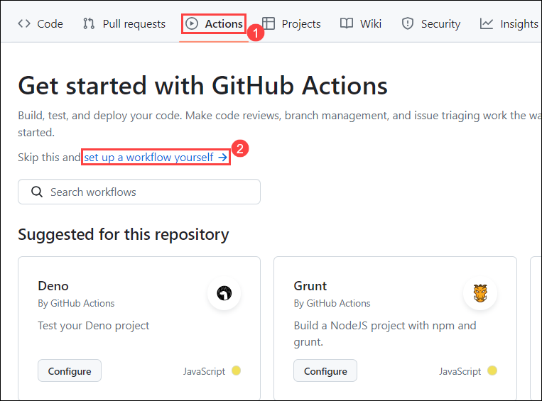

3. Navigate to the **Code** **(1)** and click on **.github/workflows** **(2)** folder.

    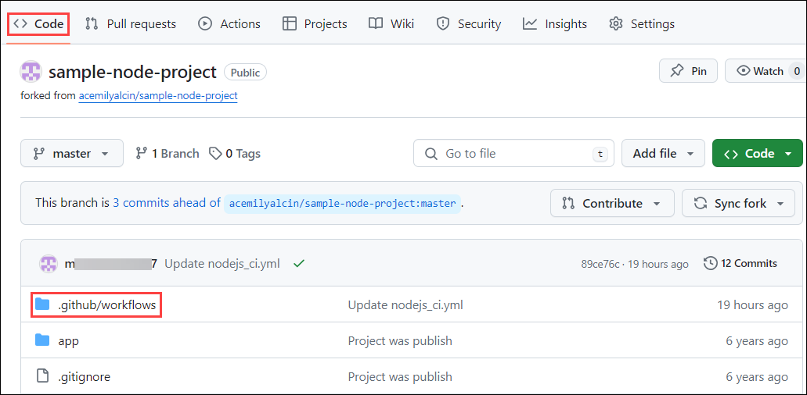

4. Provider file name as **nodejs_ci.yml** **(1)**, in the editor **copy and paste** **(2)** the below script, and click in **commit changes** **(3)**.

    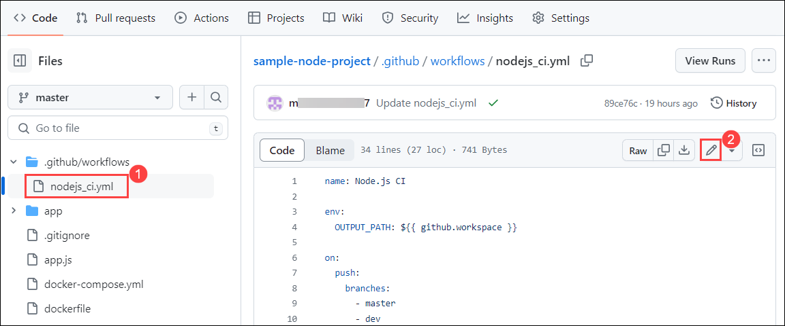

    ```
    name: Node.js CI
    
    env:
      OUTPUT_PATH: ${{ github.workspace }}
    
    on:
      push:
        branches:
          - master
          - dev
    
    jobs:
      build:
        runs-on: ubuntu-latest
    
        strategy:
          matrix:
            node-version: [18.x]
    
        steps:
          - uses: actions/checkout@v3
    
          - name: Cache Node.js dependencies
            uses: actions/cache@v2
            with:
              path: ~/.npm
              key: ${{ runner.os }}-node-${{ matrix.node-version }}-${{ hashFiles('${{ env.OUTPUT_PATH }}/package-lock.json') }}
              restore-keys: |
                ${{ runner.os }}-node-${{ matrix.node-version }}-
    
          - name: Use Node.js ${{ matrix.node-version }}
            uses: actions/setup-node@v3
            with:
              node-version: ${{ matrix.node-version }}
    ```

    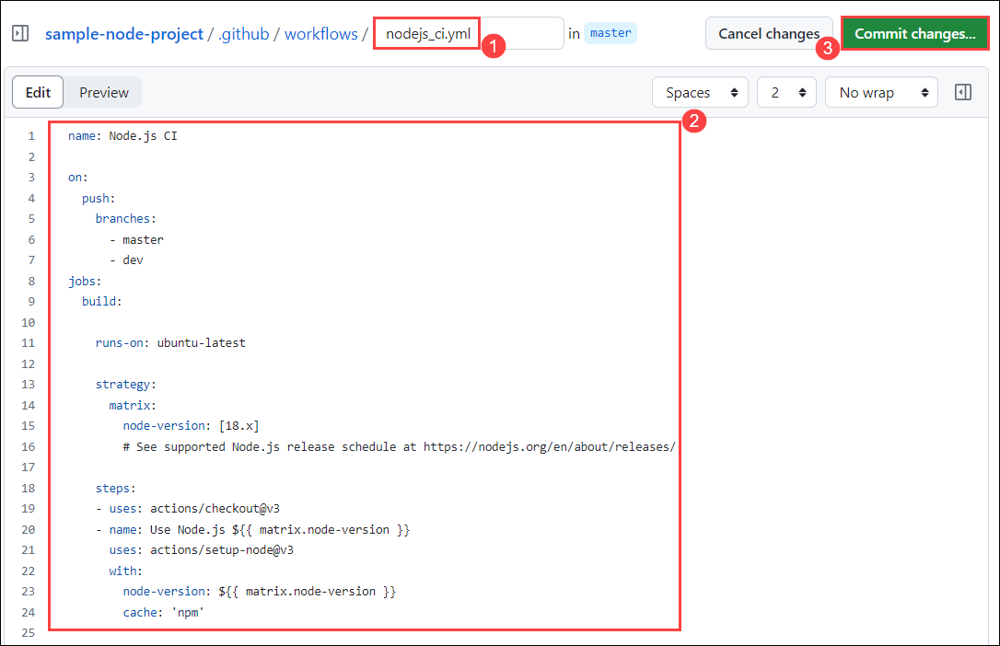

5. In the pop up windows of **Commit Changes** click on the **Commit changes**.

    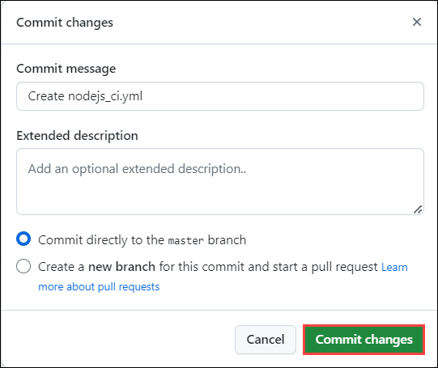

6. Click on **Action** **(1)**, verify the workflow has been executed successfully once the workflow is succedded select the newly created workflow **Create nodejs_ci.yml** **(2)**.

    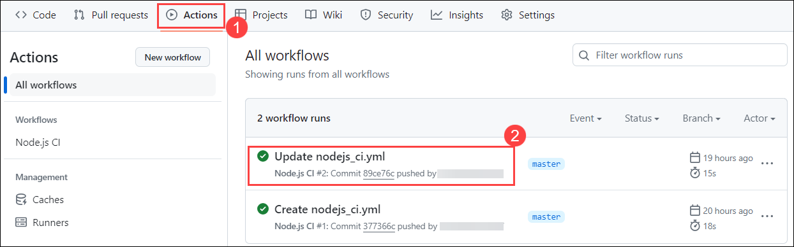

    > Feel free to go through the workflow

### Task 2: Using artifacts and dependencies in workflows

Optimizing workflow performance by caching dependencies can significantly improve the execution time of your workflows. By caching dependencies, you can avoid unnecessary downloads and installations, resulting in faster and more efficient workflows.

- **Identify Dependencies**: Determine which dependencies in your project take a long time to install.
- **Add Cache Step**: In your GitHub Actions workflow file, add a step that uses the `actions/cache@v3` action.
- **Configure Cache Key**: Set the `key` to an expression that uniquely identifies each set of dependencies. This typically includes the package manager's lock file.
- **Specify Path**: Set the `path` to the directory where dependencies are installed.
- **Restore Cache**: If a cache hit occurs, the action restores the cached dependencies.

1. Navigate to the **Code** **(1)** and click on **.github/workflows** **(2)** folder.

    

2. In the **.github/workflows** folder, select **nodejs_ci.yml** **(1)** and click on **edit** **(2)**.

    

3. Replace the following code with the below code.

    ```
    name: Node.js CI
    
    env:
      OUTPUT_PATH: ${{ github.workspace }}
    
    on:
      push:
        branches:
          - master
          - dev
    
    jobs:
      build:
        runs-on: ubuntu-latest
    
        steps:
          - uses: actions/checkout@v3
    
          - name: Cache Node.js dependencies
            uses: actions/cache@v2
            with:
              path: ~/.npm
              key: ${{ runner.os }}-node-${{ hashFiles('${{ env.OUTPUT_PATH }}/package-lock.json') }}
              restore-keys: |
                ${{ runner.os }}-node-
    
          - name: Use Node.js
            uses: actions/setup-node@v3
            with:
              node-version: 18.x
    ```
    
    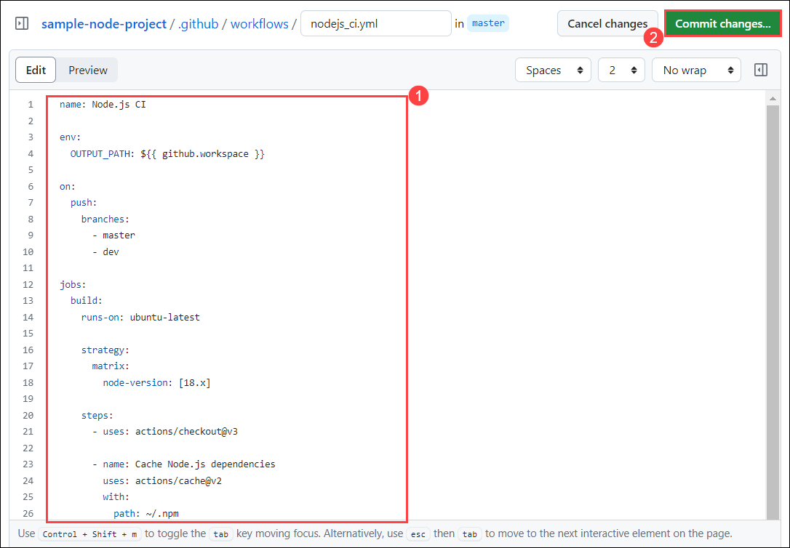

4. In the pop up windows of **Commit Changes** click on the **Commit changes**.

    

5. Click on **Action** **(1)**, verify the workflow has been executed successfully once the workflow is succedded select the newly created workflow **Create nodejs_ci.yml** **(2)**.

    

    > Feel free to go through the workflow

### Task 3: Code scanning and vulnerability detection

1. Naviage back to `github-action` repo.

1. Click on **Security** **(1)**, and click on **Enable vulnerability reporting** **(2)** next to the Private vulnerability reporting

    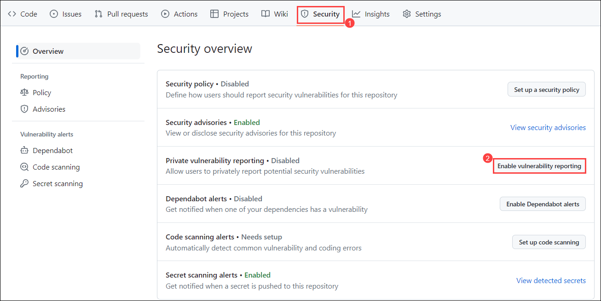

1. Once naviagted to **Code security and analysis**, click on **Enable** button for Private vulnerability reporting, Dependabot alerts, Dependabot security updates, and Dependabot on Actions runners.

    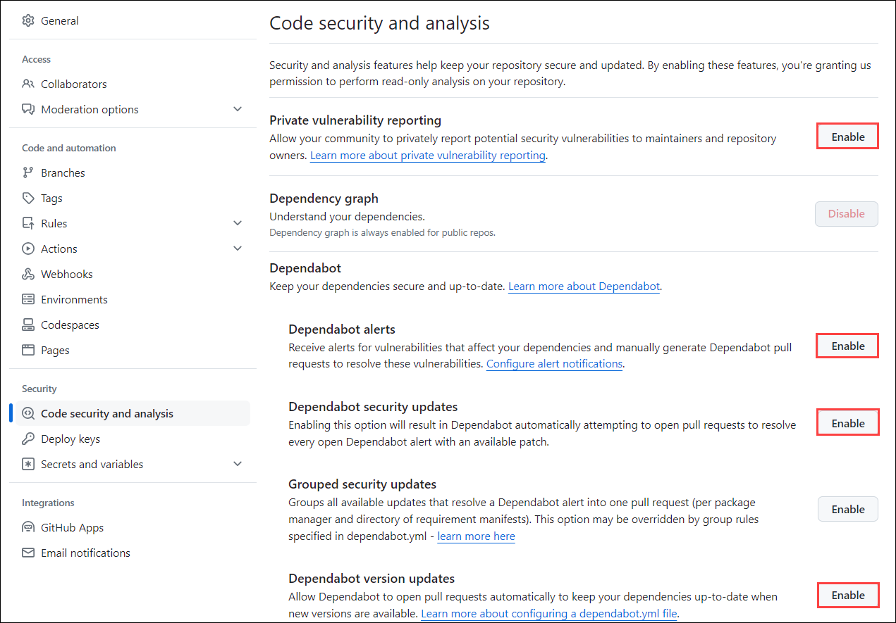

1. Click on **Set up** **(1)** button to enable CodeQL analysis and select the **Advanced** **(2)** option for creating a CodeQL Analysis YAML file.

   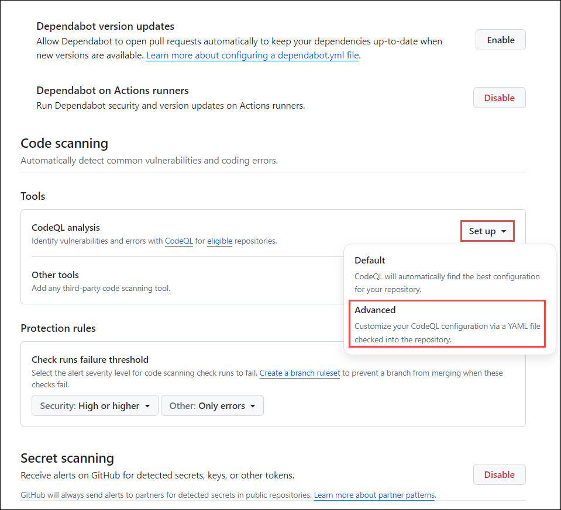      

1. Update the workflow name to **codeql-analysis.yml** ***(1)*** and review the yaml file. Select **Commit changes** ***(2)***, then select **Commit directly to the main branch** ***(3)*** and click on **Commit new file** ***(4)***.
  
   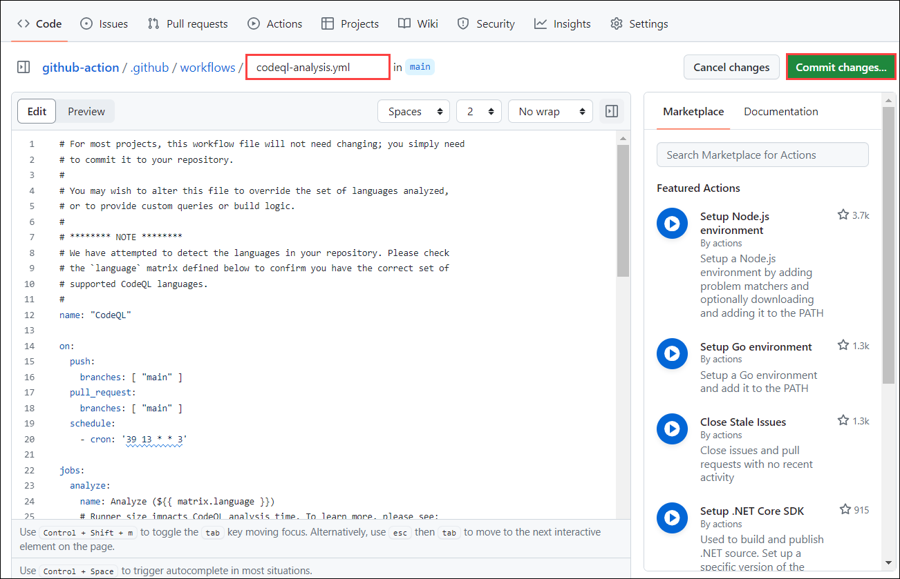

   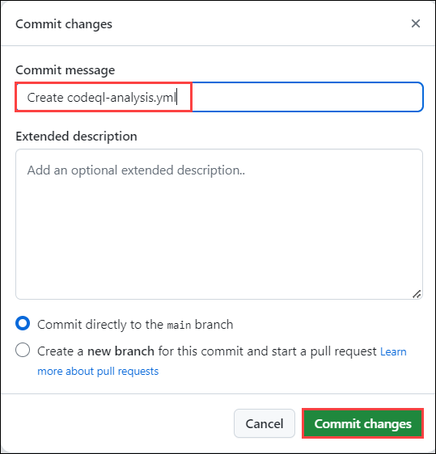 
  
1. Navigate to **Actions** ***(1)*** tab, You can review the **workflow** ***(2)*** run.
    
   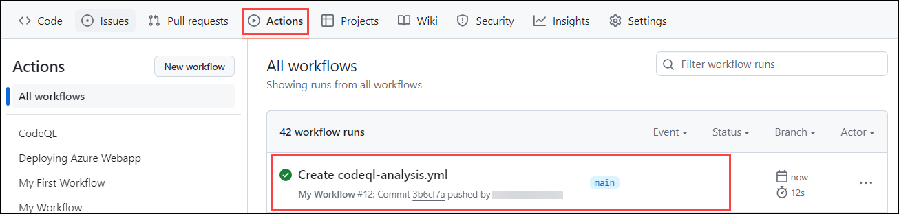 
  
1. Navigate to **Security** ***(1)*** tab and click on **View alerts** ***(2)***.
   
   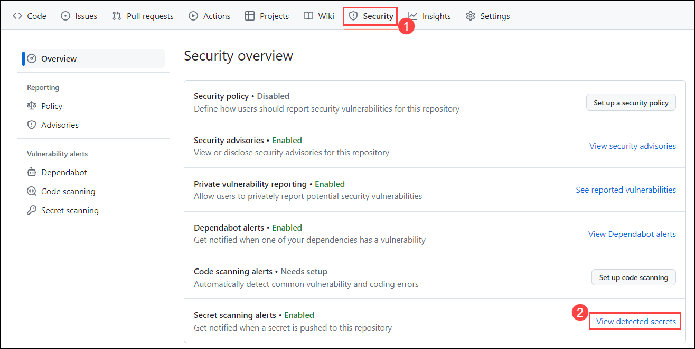
  
1. You will be navigated to **Code scanning** section. You'll be able to visualize that the **No code scanning alerts here!**.
   
   

### Summary

In this, you learn how to securely store sensitive data such as API keys and passwords within a GitHub repository using secrets, ensuring that this data remains protected and separate from the codebase. The code details the process for creating and managing these secrets and how to reference them in workflows to maintain security. Matrix builds enhance workflows by allowing the same workflow to run across multiple configurations, such as different language versions or operating systems. The code demonstrates defining a configuration matrix to run jobs in parallel, which boosts testing efficiency and ensures compatibility across various environments. This comprehensive approach to handling secrets, matrix builds, and artifacts ensures robust security, efficient testing, and effective data management in GitHub workflows.
